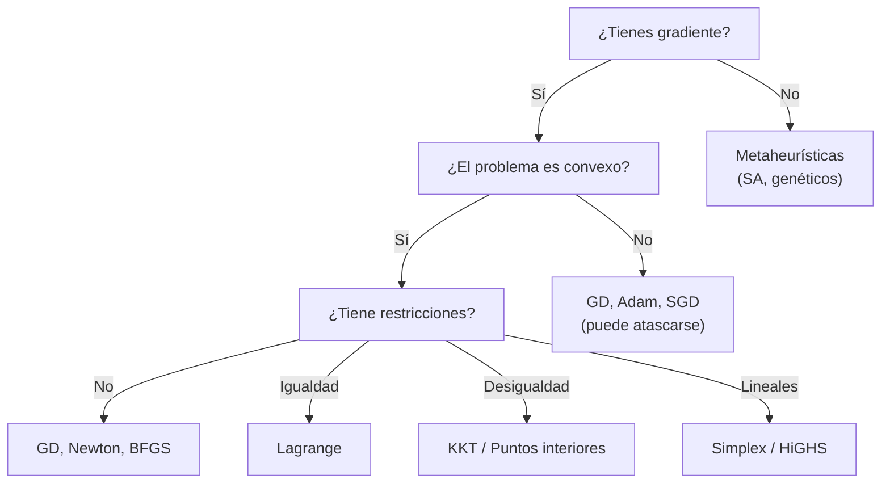

# Algoritmos de optimización: intuiciones

Esta sección da una vista panorámica de los algoritmos más importantes. No vamos a derivar nada formalmente — la meta es construir **intuición** sobre cuándo y por qué funciona cada método.

---

## Descenso de gradiente (sin restricciones)

La idea más simple y poderosa: **camina cuesta abajo**.

$$x_{k+1} = x_k - \alpha \nabla f(x_k)$$

donde $\alpha > 0$ es el **learning rate** (tasa de aprendizaje).

### Intuición

- $\nabla f(x_k)$ apunta en la dirección de **mayor crecimiento** de $f$.
- El negativo $-\nabla f(x_k)$ apunta "cuesta abajo".
- $\alpha$ controla el tamaño del paso.

### El learning rate importa mucho

| $\alpha$ muy pequeño | $\alpha$ muy grande |
|---|---|
| Convergencia lenta pero segura | Puede divergir (oscilar o explotar) |
| Muchos pasos para llegar | Pocos pasos pero inestable |

### Criterios de convergencia — ¿cuándo parar?

Descenso de gradiente es iterativo: ¿cómo sabemos que ya llegamos? Tres criterios comunes:

1. **Norma del gradiente:** $\|\nabla f(x_k)\| < \varepsilon$ — "el terreno es casi plano"
2. **Cambio en la función:** $|f(x_{k+1}) - f(x_k)| < \varepsilon$ — "ya no mejoramos"
3. **Cambio en parámetros:** $\|x_{k+1} - x_k\| < \varepsilon$ — "ya no nos movemos"

En `scipy.optimize.minimize`, estos corresponden a los parámetros `gtol`, `ftol` y `xtol`. Internamente, scipy combina varios de estos criterios.

En la práctica de ML, es común usar un **número fijo de épocas** (por ejemplo, "entrena 100 épocas"). Esto no es principiado — puedes estar parando demasiado pronto o demasiado tarde — pero es simple y predecible.

> **Notebook — Abre NB2, Secciones 1-3: GD y learning rates**
> 
>
> 1. Ejecuta GD en la cuadrática con `lr=0.08`. ¿Cuántos pasos necesita para converger?
> 2. Prueba `lr=0.33` vs `lr=0.34` en $f(x,y) = 3x^2 + y^2$. ¿Qué pasa?
> 3. El learning rate crítico es $\alpha_{\text{crit}} = 2/L_{\max}$ donde $L_{\max}$ es el eigenvalor más grande del Hessiano. Para $3x^2 + y^2$, $L_{\max} = 6$, así que $\alpha_{\text{crit}} = 1/3 \approx 0.333$.

---

## Descenso de gradiente estocástico (SGD)

En ML, la función objetivo es típicamente una **suma** sobre datos:

$$f(x) = \frac{1}{N} \sum_{i=1}^{N} f_i(x)$$

El gradiente completo es costoso: hay que evaluar $f_i$ para **cada** dato. Con millones de muestras, una sola iteración de GD es prohibitiva.

**Idea de SGD:** El gradiente completo es una **esperanza**: $\nabla f(x) = \mathbb{E}_i[\nabla f_i(x)]$. Podemos estimarlo con un subconjunto aleatorio (**mini-batch**) de $B$ muestras:

$$x_{k+1} = x_k - \alpha \frac{1}{|B|} \sum_{i \in B} \nabla f_i(x_k)$$

El gradiente estimado es ruidoso, pero en promedio apunta en la dirección correcta.

### ¿Por qué funciona el ruido?

- **Ventaja:** El ruido ayuda a **escapar puntos silla** y mínimos locales poco profundos. Un gradiente ruidoso puede "sacudir" al algoritmo fuera de una trampa (recuerda la discusión de puntos silla en la [sección de paisaje](02_paisaje_y_conceptos.md)).
- **Costo:** La convergencia es más ruidosa — la trayectoria zigzaguea en lugar de descender suavemente.

### Learning rate schedules

Con SGD, el learning rate importa aún más:
- **Constante:** simple pero puede oscilar eternamente cerca del óptimo
- **Decay:** $\alpha_k = \alpha_0 / (1 + k \cdot d)$ — reduce el ruido gradualmente
- **Warmup:** empieza pequeño, sube, y luego baja — estabiliza el inicio del entrenamiento

### Adam: el optimizador por defecto

**Adam** (Adaptive Moment Estimation) adapta el learning rate **por parámetro** usando estimados del primer y segundo momento del gradiente. Intuitivamente: parámetros con gradientes consistentes reciben pasos grandes; parámetros con gradientes erráticos reciben pasos pequeños. Es el optimizador por defecto en deep learning moderno.

> **Notebook — Abre NB2, Sección SGD: SGD vs batch GD**
> 
>
> 1. Compara las curvas de convergencia de GD completo vs SGD en regresión lineal sintética.
> 2. ¿Cuál converge más rápido en tiempo de reloj? ¿Cuál tiene trayectoria más suave?
> 3. Cambia el tamaño del mini-batch. ¿Qué pasa con batch_size=1 vs batch_size=N?

---

## Métodos de segundo orden — intuición

Descenso de gradiente usa información de **primer orden** (la pendiente). ¿Qué pasa si también usamos la **curvatura**?

### Newton's method

El método de Newton usa el **Hessiano** $H$ (matriz de segundas derivadas) para tomar pasos más inteligentes:

$$x_{k+1} = x_k - H^{-1} \nabla f(x_k)$$

**Intuición:** GD camina a velocidad constante en todas las direcciones. Newton toma pasos **grandes en direcciones planas** (poca curvatura) y **pequeños en direcciones empinadas** (mucha curvatura). Es como ajustar el learning rate automáticamente por dirección.

### El problema: el costo

Calcular $H^{-1}$ cuesta $O(n^3)$ donde $n$ es el número de parámetros. Para una red neuronal con millones de parámetros, esto es imposible.

### L-BFGS: lo mejor de dos mundos

**L-BFGS** (Limited-memory BFGS) **aproxima** $H^{-1}$ usando solo el historial reciente de gradientes. No requiere calcular el Hessiano completo — solo guarda los últimos ~10 gradientes y hace una aproximación.

Por eso `scipy.optimize.minimize` con `method='L-BFGS-B'` destruye a nuestro GD casero en Rosenbrock: usa información de curvatura aproximada para navegar el valle banana eficientemente.

> **Notebook — Abre NB2, Secciones 4 y 6: Rosenbrock**
> 
>
> 1. Ejecuta GD en Rosenbrock con 5000 pasos. ¿Qué tan cerca llega del óptimo (1,1)?
> 2. Compara con `scipy.optimize.minimize` (L-BFGS-B). ¿Cuántas evaluaciones necesita?
> 3. ¿Por qué L-BFGS-B gana? Porque usa información de curvatura (segundo orden).

---

## Multiplicadores de Lagrange (restricciones de igualdad)

¿Cómo minimizas $f(x)$ cuando $x$ debe estar sobre una superficie $h(x) = 0$?

**Intuición geométrica:** en el óptimo, el gradiente de $f$ es **paralelo** al gradiente de $h$. Si no fueran paralelos, podrías moverte a lo largo de la restricción y seguir bajando.

$$\nabla f(x^*) = \lambda \nabla h(x^*)$$

Esto se formaliza con el **Lagrangiano**:

$$\mathcal{L}(x, \lambda) = f(x) + \lambda \, h(x)$$

El óptimo se encuentra resolviendo $\nabla_x \mathcal{L} = 0$ y $\nabla_\lambda \mathcal{L} = 0$ (que equivale a $h(x) = 0$).

### Ejemplo trabajado

$\min \quad x^2 + y^2 \quad$ sujeto a $\quad x + y = 1$

Lagrangiano: $\mathcal{L}(x, y, \lambda) = x^2 + y^2 + \lambda(x + y - 1)$

<strong>Ver Solución</strong>

Condiciones de primer orden:

$$
\begin{aligned}
\frac{\partial \mathcal{L}}{\partial x} &= 2x + \lambda = 0 \quad \Rightarrow \quad x = -\lambda/2 \\
\frac{\partial \mathcal{L}}{\partial y} &= 2y + \lambda = 0 \quad \Rightarrow \quad y = -\lambda/2 \\
\frac{\partial \mathcal{L}}{\partial \lambda} &= x + y - 1 = 0
\end{aligned}
$$

De las dos primeras: $x = y$. Sustituyendo en la tercera: $2x = 1 \Rightarrow x = y = 1/2$.

Solución: $(x^*, y^*) = (1/2, 1/2)$, con $f^* = 1/2$.

**Conexión con módulo 06:** Los multiplicadores de Lagrange aparecen también en la derivación de la distribución de máxima entropía (MaxEnt de Jaynes). Allí, maximizas entropía sujeto a restricciones de momentos — exactamente la misma estructura.

> **Notebook — Abre NB2, Sección 7: Lagrange**
> 
>
> 1. Verifica que scipy confirma la solución analítica $(0.5, 0.5)$.
> 2. Cambia la restricción a $x + y = 2$. ¿Cómo cambia la solución?
> 3. Observa los contornos: el óptimo está donde la restricción es **tangente** a una curva de nivel.

---

## Condiciones KKT (restricciones de desigualdad)

Las condiciones de **Karush-Kuhn-Tucker** extienden Lagrange a restricciones de desigualdad $g_j(x) \leq 0$.

**Intuición:** "Lagrange + restricciones activas/inactivas".

El Lagrangiano generalizado es:

$$\mathcal{L}(x, \lambda, \mu) = f(x) + \sum_i \lambda_i h_i(x) + \sum_j \mu_j g_j(x)$$

Las condiciones KKT agregan una condición clave — **holgura complementaria**:

$$\mu_j \, g_j(x) = 0 \quad \text{para todo } j$$

Esto dice: para cada restricción de desigualdad, o la restricción está **activa** ($g_j = 0$, y $\mu_j$ puede ser positivo) o está **inactiva** ($g_j < 0$, y $\mu_j = 0$, "no importa"). Nunca ambas.

No vamos a derivar KKT formalmente, pero es importante saber que **existen** y que son la base teórica de muchos solvers.

---

## Método simplex (programación lineal)

Para problemas lineales ($\min c^T x$ sujeto a $Ax \leq b$, $x \geq 0$), hay una estructura especial:

- La **región factible** es un **politopo** (poliedro acotado).
- El **óptimo siempre está en un vértice** del politopo.

El **método simplex** (Dantzig, 1947) camina de vértice en vértice, siempre mejorando el objetivo, hasta llegar al óptimo. Es extraordinariamente eficiente en la práctica, aunque teóricamente puede ser exponencial en el peor caso.

> **Notebook — Abre NB2, Sección 9: linprog**
> 
>
> 1. Resuelve el problema de producción con `linprog`. La solución está en un vértice.
> 2. Cambia `b_ub` (recursos disponibles). ¿La solución se mueve a otro vértice?
> 3. Cambia `c` (ganancias). ¿La solución salta a un vértice diferente?

---

## Metaheurísticas: cuando no hay gradiente

A veces no puedes (o no quieres) calcular gradientes: la función es ruidosa, discontinua, o de caja negra. Ahí entran las **metaheurísticas**:

**Simulated annealing** (recocido simulado): Inspirado en metalurgia. Acepta soluciones peores con probabilidad decreciente (controlada por una "temperatura" que baja con el tiempo). Esto permite escapar de mínimos locales al inicio y refinar al final.

**Algoritmos genéticos**: Inspirados en evolución. Mantienen una "población" de soluciones candidatas, las combinan (crossover), mutan, y seleccionan las mejores. Útiles cuando el espacio de búsqueda es combinatorio o discreto.

---

## Taxonomía de algoritmos

---

:::exercise{title="Ejercicio: Empareja algoritmo con problema" difficulty="1"}

Empareja cada problema con el algoritmo más apropiado:

| Problema | Algoritmo |
|----------|-----------|
| 1. $\min c^T x$ s.t. $Ax \leq b$ | a. Descenso de gradiente |
| 2. Entrenar una red neuronal | b. Simplex |
| 3. $\min f(x)$ s.t. $h(x) = 0$, $f$ y $h$ diferenciables | c. Simulated annealing |
| 4. Optimizar una función de caja negra ruidosa | d. Multiplicadores de Lagrange |

<strong>Ver Solución</strong>

1 → b (Simplex: problema lineal)
2 → a (Descenso de gradiente / SGD / Adam: sin restricciones, con gradiente)
3 → d (Lagrange: restricción de igualdad, diferenciable)
4 → c (Simulated annealing: sin gradiente, función de caja negra)

:::

---

**Siguiente:** [Ejemplos en Python →](04_ejemplos_python.md)
