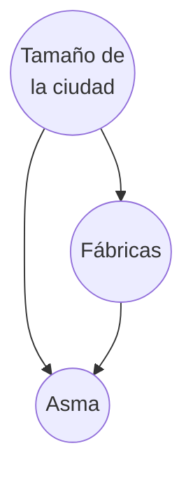
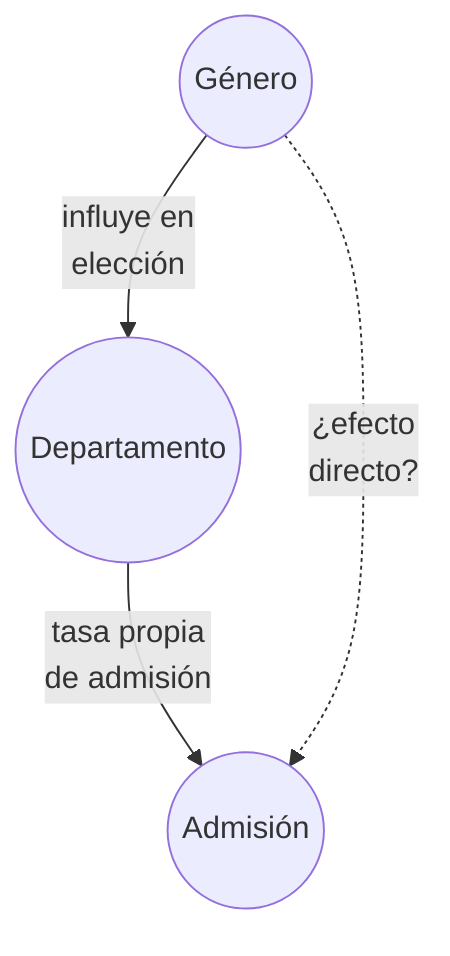
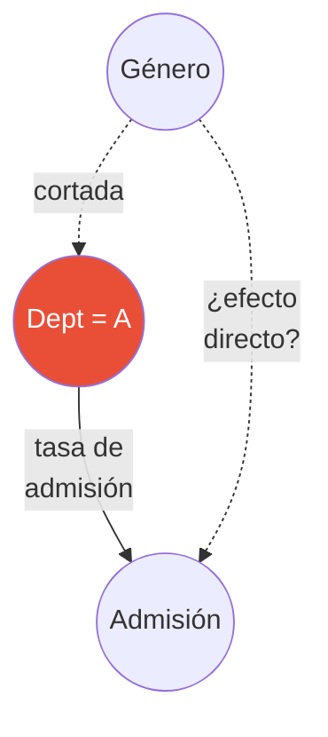
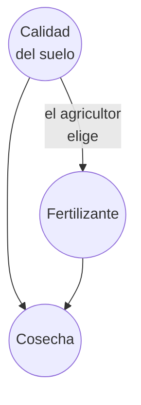
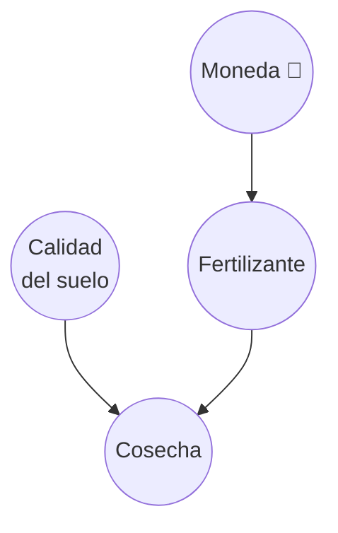
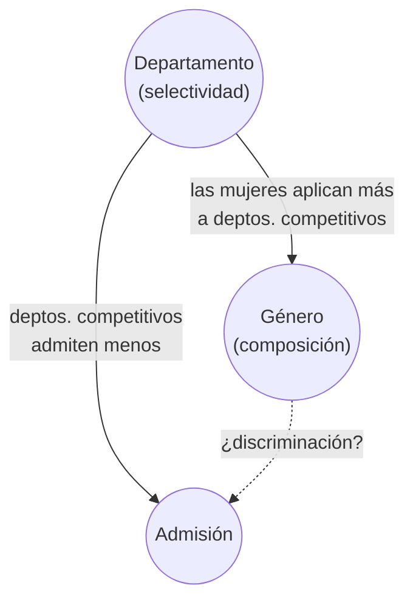
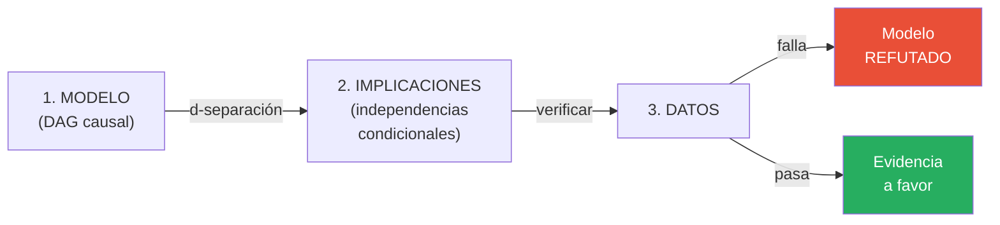
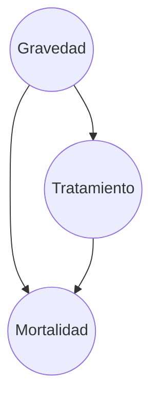
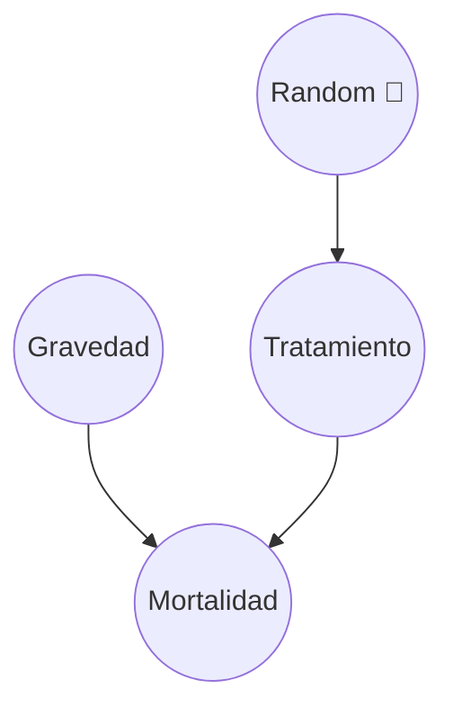

# Causalidad y el Operador do

> *"The question 'What would happen if we do X?' can never be answered from data alone, no matter how large the dataset."*
> — Judea Pearl

---

## Observar vs. Intervenir

Hay una diferencia fundamental entre **ver** que algo ocurre y **hacer** que ocurra. La probabilidad clásica no distingue entre ambas.

```
OBSERVAR                              INTERVENIR
────────                              ──────────
"La gente que lleva paraguas          "Si OBLIGAMOS a todos a
 se moja más"                          llevar paraguas,
                                       ¿se mojan más?"
P(mojado ∣ paraguas) alto
                                      P(mojado ∣ do(paraguas)) = P(mojado)
¿Por qué?
                                      ¿Por qué?
Porque la lluvia causa ambos:         Porque al forzar el paraguas,
 lluvia → paraguas                     rompemos la conexión con
 lluvia → mojarse                      la lluvia. El paraguas ya
                                       no es señal de lluvia.
La correlación es espuria.
                                      La intervención revela que
                                       el paraguas no causa mojarse.
```

La notación $do(X = x)$ fue introducida por Judea Pearl para formalizar esta distinción:

- $P(Y \mid X = x)$ — **probabilidad condicional**: ¿cuál es la probabilidad de $Y$ si *observo* que $X = x$?
- $P(Y \mid do(X = x))$ — **probabilidad intervencionista**: ¿cuál es la probabilidad de $Y$ si *fuerzo* $X = x$?

Estas dos cantidades pueden ser muy diferentes cuando hay confounders.

:::example{title="Observar vs. Intervenir: fábricas y asma"}
Imagina que observas que las ciudades con más fábricas tienen más casos de asma.

$$P(\text{asma} \mid \text{fábricas} = \text{muchas}) > P(\text{asma} \mid \text{fábricas} = \text{pocas})$$

¿Significa que las fábricas causan asma? No necesariamente. Tal vez las ciudades grandes tienen más fábricas **y** más autos (que también causan contaminación).



Para saber si las fábricas causan asma, necesitamos $P(\text{asma} \mid do(\text{fábricas} = \text{muchas}))$.
:::

---

## Cirugía de grafos

El operador $do(X = x)$ tiene una interpretación gráfica elegante: **corta todas las flechas que llegan a $X$** y fija su valor.

¿Por qué? Cuando *observamos* $X = x$, el valor de $X$ fue determinado por sus causas. Esas causas pueden estar correlacionadas con $Y$ por otros caminos. Pero cuando *intervenimos* y fijamos $X = x$, las causas de $X$ ya no importan — nosotros decidimos el valor.

### Ejemplo: Berkeley

**Grafo original** (observacional):



**Grafo mutilado** — $do(\text{Dept} = A)$:



Al hacer $do(\text{Dept} = A)$, cortamos la flecha Género → Departamento. Ahora el departamento no depende del género — **nosotros** lo fijamos. Esto nos permite medir el efecto directo del género sobre la admisión sin la distorsión del departamento.


**La regla general:**

$$do(X = x) \implies \text{eliminar todas las flechas} \rightarrow X \text{ y fijar } X = x$$

En el lenguaje de **ecuaciones estructurales**, $do(X = x)$ significa: reemplazar la ecuación que genera $X$ (que depende de sus causas) por la constante $X = x$, y dejar **todas las demás ecuaciones intactas**. Por ejemplo, si nuestro modelo es:

- $Z \sim \mathcal{N}(0, 1)$
- $X = 0.7 \cdot Z + \epsilon_X$ ← **esta ecuación se elimina**
- $Y = 2.0 \cdot X + 3.0 \cdot Z + \epsilon_Y$ ← esta se mantiene

Después de $do(X = 3)$, el sistema se convierte en:

- $Z \sim \mathcal{N}(0, 1)$
- $X = 3$ ← **constante**, ya no depende de $Z$
- $Y = 2.0 \cdot 3 + 3.0 \cdot Z + \epsilon_Y = 6 + 3Z + \epsilon_Y$

Las demás ecuaciones no cambian — cada una representa un **mecanismo autónomo** del mundo. Intervenir en $X$ cambia *cómo se genera $X$*, no cómo $Y$ responde a $X$.

---

## La fórmula de ajuste

Si no podemos intervenir físicamente (no podemos asignar departamentos al azar), ¿podemos calcular $P(Y \mid do(X))$ a partir de **datos observacionales**?

Sí, si conocemos el confounder $Z$. La **fórmula de ajuste** (también llamada *backdoor adjustment*) dice:

$$P(Y \mid do(X = x)) = \sum_z P(Y \mid X = x, Z = z) \cdot P(Z = z)$$

<details>
<summary><strong>¿De dónde sale esta fórmula?</strong></summary>

La derivación sigue directamente de la cirugía de grafos:

1. En el **grafo mutilado** (después de $do(X=x)$), cortamos todas las flechas que llegan a $X$. Esto hace que $Z$ y $X$ sean **independientes**: $Z \perp X$.

2. Escribimos la probabilidad en el grafo mutilado usando la regla del producto:

$$P(Y \mid do(X=x)) = \sum_z P(Y \mid X=x, Z=z) \cdot P(Z=z \mid do(X=x))$$

3. Como $Z$ y $X$ son independientes en el grafo mutilado (cortamos $Z \to X$), la distribución de $Z$ no cambia cuando fijamos $X$:

$$P(Z=z \mid do(X=x)) = P(Z=z)$$

4. Sustituyendo:

$$P(Y \mid do(X=x)) = \sum_z P(Y \mid X=x, Z=z) \cdot P(Z=z)$$

La clave: $P(Y \mid X=x, Z=z)$ es la misma en ambos grafos (esa relación no se toca en la cirugía). Lo único que cambia es el peso: $P(Z)$ en vez de $P(Z \mid X)$.

</details>

Compárala con la probabilidad condicional ingenua:

$$P(Y \mid X = x) = \sum_z P(Y \mid X = x, Z = z) \cdot P(Z = z \mid X = x)$$

La diferencia está en **una sola cosa**:

| | Peso de cada estrato $z$ |
|---|---|
| **Causal** ($do$) | $P(Z = z)$ — distribución de la **población** |
| **Condicional** (ingenuo) | $P(Z = z \mid X = x)$ — distribución **sesgada** por $X$ |

:::example{title="La diferencia en una línea"}
En Berkeley, la estimación ingenua pondera cada departamento por *la fracción de mujeres que se postuló ahí*. Como las mujeres se postularon más a departamentos competitivos, el promedio ponderado **baja**.

La estimación causal pondera cada departamento por *la fracción general de solicitantes*, sin importar el género. Esto elimina el sesgo.
:::


### ¿Cuándo funciona esto?

> **Intuición backdoor (una línea):** Ajusta por confounders (forks). **Nunca** ajustes por colliders.

Ajustar por un confounder (fork) elimina la correlación espuria. Pero ajustar por un collider **crea** una correlación que no existía — exactamente lo contrario de lo que queremos. En el [notebook práctico](notebooks/causal_intro.ipynb) demostramos esto con datos simulados: dos variables independientes se vuelven correlacionadas al ajustar por su collider.

---

## RCT: el operador $do$ con las manos

Un **Randomized Controlled Trial** (RCT, ensayo aleatorizado) es la forma más directa de implementar $do(X = x)$: usas una moneda (o un generador aleatorio) para decidir quién recibe el tratamiento.

:::example{title="RCT: fertilizante y cosecha"}
Un agricultor quiere saber si un fertilizante nuevo mejora la cosecha. Tiene 100 parcelas.

**Si observa sin intervenir:**

El agricultor echa más fertilizante en las parcelas con **mejor tierra** (porque quiere maximizar ganancias). ¿Resultado? El fertilizante parece funcionar muy bien, pero parte del efecto es de la tierra, no del fertilizante.



La calidad del suelo es un **confounder**: influye tanto en la decisión de fertilizar como en la cosecha. La estimación observacional $P(\text{cosecha} \mid \text{fertilizante})$ **sobreestima** el efecto del fertilizante.

**Si hace un RCT:**

El agricultor lanza una moneda para cada parcela: cara → fertilizante, cruz → sin fertilizante. La moneda no sabe nada sobre la calidad del suelo.



La aleatorización **corta** la flecha Suelo → Fertilizante. Ahora las parcelas con y sin fertilizante tienen, en promedio, la **misma calidad de suelo**. Cualquier diferencia en cosecha se debe al fertilizante.
:::


### ¿Por qué funciona la aleatorización?

La aleatorización ($R$) hace que $X$ sea **independiente de todos los confounders**:

$$R \perp Z \implies P(Y \mid X = x, R) = P(Y \mid do(X = x))$$

Es decir: en un RCT, la correlación observada **es** el efecto causal. No necesitas ajustar por nada.

### ¿Y cuándo NO puedes hacer un RCT?

- **Ética:** No puedes obligar a la gente a fumar para ver si causa cáncer
- **Costo:** No puedes aleatorizar políticas educativas a nivel país
- **Imposibilidad:** No puedes aleatorizar el género o la edad de las personas
- **Tiempo:** Algunos efectos tardan décadas en manifestarse

En todos estos casos, necesitas estimar $P(Y \mid do(X))$ a partir de datos observacionales, usando la fórmula de ajuste. Esa es la promesa de la **inferencia causal**: respuestas de tipo RCT sin necesidad de experimentar.

---

## Simpson resuelto

Volvamos a Berkeley. ¿Hay discriminación por género en las admisiones?

Como vimos en las [estructuras causales](01_estructuras_causales.md#la-paradoja-de-simpson), la paradoja admite dos interpretaciones causales. Adoptamos la **interpretación fork**: la selectividad del departamento actúa como confounder — influye tanto en quiénes aplican como en la tasa de admisión.



El camino espurio es $\text{Género} \leftarrow \text{Depto} \rightarrow \text{Admisión}$: la selectividad del departamento genera una correlación entre género y admisión aunque no haya discriminación. Para bloquear ese camino, ajustamos por Departamento:

$$P(\text{adm} \mid do(\text{género} = \text{mujer})) = \sum_d P(\text{adm} \mid \text{mujer}, D = d) \cdot P(D = d)$$

Esto pondera cada departamento por su proporción **en la población total**, no por la proporción de mujeres. El resultado: **no hay evidencia de discriminación**. La diferencia agregada se debía a que las mujeres se postularon a departamentos más competitivos.

La fórmula de ajuste produce el mismo resultado que obtendríamos con un RCT (si pudiéramos asignar departamentos al azar). Esa es la magia: **respuestas experimentales a partir de datos observacionales**, siempre y cuando conozcamos el grafo causal correcto.

---

## Los datos no prueban causalidad

> **Advertencia fundamental:** No se puede inferir causalidad a partir de datos. Nunca. Sin importar cuántos datos tengas.

La causalidad viene del **modelo** (el DAG), no de los datos. El DAG codifica nuestras hipótesis sobre cómo funciona el mundo — qué causa qué. Los datos solo pueden hacer dos cosas:

1. **Refutar** el modelo (si las implicaciones del DAG no se cumplen en los datos)
2. **Ser consistentes** con el modelo (si las implicaciones sí se cumplen)

Pero ser consistente **no es lo mismo que probar**. Muchos DAGs diferentes pueden ser consistentes con los mismos datos.

### El marco de verificación



Todo modelo causal (DAG) implica ciertas **independencias condicionales** entre las variables, derivadas de las reglas de d-separación que vimos en las [estructuras causales](01_estructuras_causales.md):

| Estructura | Implicación testeable |
|---|---|
| **Fork** $X \leftarrow Z \rightarrow Y$ | $X \perp Y \mid Z$ — la correlación espuria desaparece al condicionar en $Z$ |
| **Chain** $X \rightarrow M \rightarrow Y$ | $X \perp Y \mid M$ — el flujo se bloquea al condicionar en el mediador |
| **Collider** $X \rightarrow C \leftarrow Y$ | $X \perp Y$ — son independientes sin condicionar en $C$ |

Estas implicaciones son **condiciones necesarias** para que el DAG sea correcto. Si no se cumplen en los datos, el modelo está mal. Si se cumplen, es evidencia a favor — pero no prueba, porque otros DAGs podrían implicar las mismas independencias.


### Independencia condicional: verificación visual

Podemos verificar una implicación de forma visual. En un fork puro ($X \leftarrow Z \rightarrow Y$, sin $X \rightarrow Y$), el DAG predice que $X \perp Y \mid Z$: la correlación entre $X$ e $Y$ debe desaparecer al condicionar en $Z$.


En la figura:
- **Panel izquierdo:** sin condicionar, $X$ e $Y$ parecen correlacionados (correlación ~0.7)
- **Panel central:** al colorear por terciles de $Z$, dentro de cada grupo la correlación casi desaparece
- **Panel derecho:** la correlación marginal (roja) es fuerte, pero las condicionales (por grupo de $Z$) son cercanas a cero

Si el DAG dijera que $X$ causa $Y$ directamente, la correlación **no** desaparecería al condicionar en $Z$. Este tipo de verificación nos permite distinguir entre DAGs alternativos.

### Diagnóstico de residuos: ¿cuál es la dirección causal?

El libro *Elements of Causal Inference* (Peters, Janzing, Schölkopf) propone una herramienta para verificar la **dirección** de una relación causal. La idea se basa en los modelos de ruido aditivo:

Si $X$ causa $Y$, entonces $Y = f(X) + N$ donde el ruido $N$ es independiente de $X$. Esto implica una **asimetría**:

| Dirección | Regresión | Residuos |
|---|---|---|
| **Causal** ($X \to Y$) | $Y = f(X) + \text{residuos}$ | Residuos **independientes** de $X$ (banda plana) |
| **Anti-causal** ($Y \to X$) | $X = g(Y) + \text{residuos}$ | Residuos **dependientes** de $Y$ (patrones visibles) |

#### ¿Por qué existe esta asimetría? El principio de independencia causa-mecanismo

La asimetría surge de un principio fundamental: **la distribución de la causa y el mecanismo causal son independientes entre sí**.

¿Qué significa esto? Que la naturaleza genera las cosas en dos pasos separados que no se "conocen":

1. **Primero** se genera $X$ según su propia distribución $P(X)$ (por ejemplo, la altitud de las estaciones meteorológicas depende de la geografía)
2. **Después** el mecanismo $f$ transforma $X$ en $Y = f(X) + N$ (la temperatura depende de la altitud por leyes físicas, más ruido climático)

El mecanismo $f$ (leyes físicas) no sabe ni le importa cómo están distribuidas las estaciones. Y la distribución de estaciones no depende de cómo la temperatura responde a la altitud. Son procesos **modulares**.

#### La matemática de la asimetría

**Dirección causal** ($X \to Y$): por construcción, $Y = f(X) + N$ con $N \perp X$. Al ajustar $Y \approx \hat{f}(X)$, los residuos son $Y - \hat{f}(X) \approx N$. Como $N$ es independiente de $X$ por hipótesis, los residuos forman una **banda plana** — sin estructura.

**Dirección anti-causal** ($Y \to X$): ahora intentamos $X = g(Y) + \text{residuos}$. Pero $Y = f(X) + N$ "mezcla" $X$ y $N$. Para distintos valores de $Y$, la composición de "$X$ original" y "ruido $N$" varía. Por ejemplo, si $f = \tanh$ (saturación): cuando $\lvert Y \rvert \approx 1$, $\tanh$ se aplana y muchos valores distintos de $X$ producen el mismo $Y$ — la función inversa $g$ no puede separar limpiamente $X$ del ruido. El resultado: los residuos muestran **heteroscedasticidad**, es decir, la dispersión (varianza) de los residuos cambia con el valor de $Y$ (*hetero* = diferente, *scedástico* = dispersión).


En la figura:
- **Fila superior (causal):** los residuos de $Y \sim f(X)$ forman una banda plana alrededor de cero, sin estructura. La correlación es cercana a 0.
- **Fila inferior (anti-causal):** los residuos de $X \sim g(Y)$ muestran heteroscedasticidad (la varianza cambia con $Y$). La correlación es mayor.

:::example{title="Intuición: altitud y temperatura"}
Imagina que $X$ es la altitud de una estación meteorológica y $Y$ es la temperatura. La altitud causa la temperatura (a mayor altitud, menor temperatura).

- **Dirección causal:** La temperatura depende de la altitud mediante una ley física estable. El ruido (clima diario, microclima) es independiente de la altitud. Residuos planos.
- **Dirección anti-causal:** Si tratas de "predecir" la altitud a partir de la temperatura, la distribución de altitudes disponibles (hay más tierras bajas que montañas) interactúa con la función inversa. Residuos con estructura.

Este diagnóstico es una **condición necesaria**, no suficiente. Si los residuos muestran estructura en la dirección propuesta, hay evidencia en contra. Si son planos, es consistente — pero no prueba la dirección.
:::

---

## DoWhy: inferencia causal en Python

[DoWhy](https://www.pywhy.org/dowhy/) es una librería de código abierto (Microsoft Research) diseñada para inferencia causal. Implementa las ideas que vimos en este módulo de manera programática.

### El algoritmo paso a paso

DoWhy sigue un pipeline de 4 pasos. Los dos primeros son **puramente gráficos** (operan sobre el DAG, no tocan los datos). Los últimos dos son **estadísticos** (usan los datos).

#### Paso 1: Modelar — definir el DAG

Se construye un grafo dirigido acíclico con las relaciones causales conocidas. Cada arista $A \rightarrow B$ significa "$A$ causa directamente $B$". Este grafo **no sale de los datos** — es conocimiento del dominio.

```python
import networkx as nx
grafo = nx.DiGraph([("Z", "X"), ("Z", "Y"), ("X", "Y")])
```

#### Paso 2: Identificar — el criterio backdoor

> **Criterio backdoor.** Un conjunto de variables $S$ satisface el criterio backdoor relativo a $(X, Y)$ en un DAG $G$ si:
>
> 1. Ningún elemento de $S$ es **descendiente** de $X$
> 2. $S$ **bloquea** todo camino entre $X$ e $Y$ que contiene una flecha *entrando* a $X$ (un "camino backdoor")
>
> Si $S$ satisface el criterio, entonces:
> $$P(Y \mid do(X=x)) = \sum_s P(Y \mid X=x, S=s) \cdot P(S=s)$$

Este es el paso clave. DoWhy recorre el grafo y aplica este criterio para determinar qué variables ajustar. El algoritmo funciona así:

**Entrada:** DAG, tratamiento $X$, resultado $Y$

1. **Enumerar caminos**: encontrar todos los caminos entre $X$ e $Y$ en el grafo (ignorando la dirección de las flechas)

2. **Clasificar caminos**:
   - **Caminos causales** (frontdoor): van de $X$ a $Y$ siguiendo las flechas. Estos son el efecto que queremos medir — **no los bloqueamos**.
   - **Caminos espurios** (backdoor): llegan a $X$ por detrás (hay una flecha *entrando* a $X$). Estos crean correlación espuria — **sí los bloqueamos**.

3. **Encontrar un conjunto de ajuste** $S$: buscar variables que bloqueen **todos** los caminos backdoor sin abrir caminos nuevos. Las reglas son:
   - Condicionar en un **no-collider** en un camino lo **bloquea** (bien para caminos espurios)
   - Condicionar en un **collider** en un camino lo **abre** (mal — crea correlación nueva)
   - Por lo tanto: ajustar por confounders (forks) ✓, **nunca** ajustar por colliders ✗

```
Ejemplo con nuestro DAG:  Z → X,  Z → Y,  X → Y

Caminos entre X e Y:
  1. X → Y                    (causal — no tocar)
  2. X ← Z → Y                (backdoor — Z es confounder)

Camino 2 es espurio. ¿Cómo bloquearlo?
  → Condicionar en Z (no-collider en el camino) → BLOQUEADO ✓

Resultado: S = {Z}
```

4. **Construir la fórmula de ajuste**: una vez identificado $S$, la fórmula es:

$$P(Y \mid do(X = x)) = \sum_s P(Y \mid X = x, S = s) \cdot P(S = s)$$

```python
identificado = modelo.identify_effect()  # encuentra S = {Z}
```

#### Paso 3: Estimar — calcular el efecto

Con el conjunto de ajuste $S$ identificado, DoWhy calcula $P(Y \mid do(X))$ usando un estimador estadístico. Con `"backdoor.linear_regression"`, internamente hace una regresión múltiple $Y \sim X + S$ y reporta el coeficiente de $X$.

```python
estimacion = modelo.estimate_effect(identificado, method_name="backdoor.linear_regression")
```

#### Paso 4: Refutar — validar robustez

DoWhy ofrece pruebas de sensibilidad para verificar si el resultado es robusto:
- **Placebo treatment**: reemplazar $X$ por ruido aleatorio. Si el efecto "causal" persiste, algo está mal.
- **Random common cause**: agregar un confounder aleatorio. Si el efecto cambia mucho, el modelo puede ser frágil.

Nosotros usamos los pasos 1–3. En el [notebook práctico](notebooks/causal_intro.ipynb) implementamos todo el pipeline y comparamos con la estimación manual.

### Resumen del algoritmo

```
┌─────────────┐     ┌──────────────────┐     ┌────────────┐     ┌──────────┐
│  1. MODELAR │────▶│  2. IDENTIFICAR  │────▶│ 3. ESTIMAR │────▶│4. REFUTAR│
│  (DAG)      │     │  (criterio       │     │ (regresión │     │(placebo, │
│             │     │   backdoor)      │     │  ajustada) │     │ robustez)│
│ Solo grafo, │     │  Solo grafo,     │     │ Datos +    │     │ Datos    │
│ no datos    │     │  no datos        │     │ fórmula    │     │          │
└─────────────┘     └──────────────────┘     └────────────┘     └──────────┘
```

### ¿En qué se diferencia de redes bayesianas?

En el [módulo de redes bayesianas](../10_redes_bayesianas/01_probabilidad_y_grafos.md) vimos un algoritmo que también usa un DAG: **eliminación de variables**. Ambos algoritmos comparten estructura (un DAG + datos), pero resuelven problemas fundamentalmente distintos.

| | Redes Bayesianas | Grafos Causales (DoWhy) |
|---|---|---|
| **Pregunta** | $P(Y \mid X = x)$ — ¿qué predigo de $Y$ si *observo* $X$? | $P(Y \mid do(X = x))$ — ¿qué pasa con $Y$ si *intervengo* en $X$? |
| **Qué significa una flecha** | Dependencia condicional directa. Se puede invertir si la factorización se mantiene. | **Mecanismo causal**. La dirección importa: invertirla cambia el significado. |
| **Qué hace el algoritmo con el grafo** | **Factorizar** la conjunta: $P(X_1, \ldots, X_n) = \prod_i P(X_i \mid \text{padres}(X_i))$, luego **marginalizar** variables ocultas (eliminación de variables) | **Identificar** qué ajustar: recorrer caminos, clasificarlos (causal/backdoor), encontrar el conjunto de ajuste $S$ (criterio backdoor) |
| **Operación central** | Suma-producto: multiplicar factores y marginalizar | Cirugía de grafos: cortar flechas entrantes a $X$ para obtener el grafo mutilado |
| **Complejidad** | Depende del **treewidth** $w$: $O(n \cdot d^{w+1})$ | Depende del número de **caminos** entre $X$ e $Y$ (típicamente manejable) |
| **Los datos** | Se usan para **inferir** (calcular probabilidades posteriores) | Se usan para **estimar** (calcular el efecto causal una vez identificado) |

**La diferencia clave en una línea:** la red bayesiana responde *"¿qué predigo?"* — el grafo causal responde *"¿qué pasa si intervengo?"*.

:::example{title="Mismo DAG, preguntas distintas"}
Considera el DAG: Lluvia → Piso mojado → Resbalón.

- **Red bayesiana:** Si observo un resbalón ($\text{Resbalón} = \text{sí}$), ¿cuál es la probabilidad de que haya llovido? → Usa eliminación de variables para calcular $P(\text{Lluvia} \mid \text{Resbalón})$.

- **Grafo causal:** Si *intervengo* y mojo el piso con una manguera ($do(\text{Piso} = \text{mojado})$), ¿aumenta la probabilidad de resbalón? → Usa cirugía de grafos: corta la flecha Lluvia → Piso, aplica fórmula de ajuste. Resultado: sí, mojar el piso causa resbalones independientemente de la lluvia.

La red bayesiana y el grafo causal usan el **mismo DAG** pero responden preguntas diferentes. La red bayesiana propaga evidencia; el grafo causal simula intervenciones.
:::

Ambos algoritmos usan **d-separación** para razonar sobre independencias condicionales en el grafo. La diferencia es *para qué*: la red bayesiana la usa para optimizar la inferencia (evitar cálculos innecesarios); el grafo causal la usa para identificar qué variables ajustar (criterio backdoor).

**Referencias:**
- [Documentación oficial de DoWhy](https://www.pywhy.org/dowhy/)
- [Tutorial introductorio](https://www.pywhy.org/dowhy/main/getting_started/intro.html)
- [Repositorio en GitHub](https://github.com/py-why/dowhy)

---

:::exercise{title="Aplica lo aprendido"}
Un hospital observa que los pacientes que reciben un tratamiento nuevo (T) tienen mayor mortalidad que los que no lo reciben.



1. ¿Qué tipo de estructura forma Gravedad con respecto a Tratamiento y Mortalidad?
2. ¿Por qué la estimación ingenua $P(\text{mortalidad} \mid T = \text{sí})$ está sesgada?
3. Escribe la fórmula de ajuste para estimar $P(\text{mortalidad} \mid do(T = \text{sí}))$.
4. ¿Qué haría un RCT en este caso? Dibuja el grafo.
:::

<details>
<summary><strong>Ver Respuestas</strong></summary>

1. **Fork.** Gravedad → Tratamiento, Gravedad → Mortalidad. Es la misma estructura que Berkeley.

2. Los doctores dan el tratamiento a los pacientes más graves. Los pacientes graves tienen mayor mortalidad de todas formas. La estimación ingenua mezcla el efecto del tratamiento con el efecto de la gravedad.

3. $P(\text{mortalidad} \mid do(T = \text{sí})) = \sum_g P(\text{mortalidad} \mid T = \text{sí}, G = g) \cdot P(G = g)$

   Ponderamos por la distribución de gravedad en la **población**, no entre los que recibieron el tratamiento.

4. Un RCT asignaría el tratamiento al azar, sin importar la gravedad:



La aleatorización corta la flecha Gravedad → Tratamiento. Ahora el grupo tratado y el control tienen la misma distribución de gravedad.

</details>

---

**Anterior:** [Estructuras Causales](01_estructuras_causales.md) | **Siguiente:** [Notebook práctico →](notebooks/causal_intro.ipynb)
