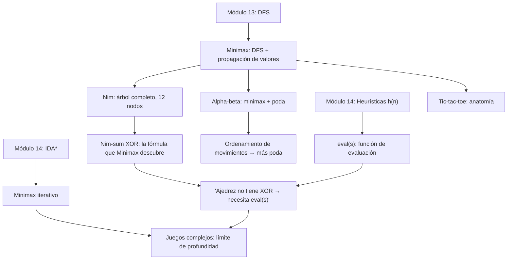

# Búsqueda Adversarial

> *"The best move is the one your opponent least wants you to make."*

En los módulos 13 y 14 resolvimos problemas donde un solo agente controla cada decisión: encontrar un camino en un laberinto, navegar un grafo ponderado, resolver el puzzle de 8 piezas. El entorno era inerte — esperaba pacientemente mientras buscábamos. En este módulo el entorno **responde**: un oponente toma decisiones activamente para frustrar las nuestras. Este cambio convierte la búsqueda de caminos en búsqueda de estrategias. Los tres ejemplos del módulo — tic-tac-toe, Nim y ajedrez — ilustran cómo un mismo marco formal escala desde juegos de bolsillo hasta los sistemas de IA más estudiados de la historia.

---

## Contenido

| Sección | Tema | Idea clave |
|:-------:|------|-----------|
| 15.1 | [Juegos como búsqueda](01_juegos_como_busqueda.md) | 7 componentes formales, árbol de juego, tic-tac-toe y Nim |
| 15.2 | [Tipos de juegos](02_tipos_de_juegos.md) | Suma cero, información perfecta, por qué importa para los algoritmos |
| 15.3 | [Minimax](03_minimax.md) | DFS con propagación de valores; Nim(1,2) completo |
| 15.4 | [Poda alfa-beta](04_poda_alfa_beta.md) | Misma respuesta, menos trabajo; Nim(2,3) |
| 15.5 | [Juegos complejos](05_juegos_complejos.md) | Límite de profundidad, eval, nim-sum XOR, ajedrez |

---

## Materiales y flujo de trabajo

| Paso | Material | Colab | Descripción |
|:----:|---------|:-----:|-------------|
| 1 | [15.1 Juegos como búsqueda](01_juegos_como_busqueda.md) | — | 7 componentes formales, árbol de juego, tic-tac-toe y Nim |
| 2 | [15.2 Tipos de juegos](02_tipos_de_juegos.md) | — | Suma cero, información perfecta, taxonomía |
| 3 | [Notebook 01 — Juegos y árboles](notebooks/01_juegos_y_arboles.ipynb) | <a href="COLAB_URL" target="_blank"></a> | Construir y visualizar árboles de juego para tic-tac-toe y Nim |
| 4 | [15.3 Minimax](03_minimax.md) | — | DFS con propagación de valores, traza Nim(1,2) |
| 5 | [15.4 Poda alfa-beta](04_poda_alfa_beta.md) | — | Misma respuesta, menos trabajo; análisis de eficiencia |
| 6 | [Notebook 02 — Minimax y alpha-beta](notebooks/02_minimax_y_alphabeta.ipynb) | <a href="COLAB_URL" target="_blank"></a> | Implementar y comparar minimax vs alpha-beta paso a paso |
| 7 | [15.5 Juegos complejos](05_juegos_complejos.md) | — | Límite de profundidad, eval, nim-sum, ajedrez |
| 8 | Notebook de aplicación (elige uno) | — | Exploración profunda en un dominio concreto |

### Notebooks de aplicación

Elige **uno** de los siguientes:

| Notebook | Tema | Colab |
|---------|------|:-----:|
| [03 — Tic-tac-toe](notebooks/aplicaciones/03_tictactoe.ipynb) | Agente completo: minimax vs random vs alpha-beta, función eval, extensión 4×4 | <a href="COLAB_URL" target="_blank"></a> |
| [04 — Nim y teoría de juegos](notebooks/aplicaciones/04_nim_teoria.ipynb) | Minimax → patrón XOR → Sprague-Grundy | <a href="COLAB_URL" target="_blank"></a> |

---

## Objetivos de aprendizaje

Al terminar este módulo podrás:

1. **Modelar** un juego de dos jugadores usando los 7 componentes formales y mapearlos a ejemplos concretos
2. **Distinguir** juegos suma-cero de no-suma-cero y explicar por qué esa distinción importa para el diseño de algoritmos
3. **Implementar** minimax recursivo y trazar su ejecución completa en Nim(1,2)
4. **Explicar** la conexión entre minimax y DFS: misma estructura, distinto propósito al retroceder
5. **Implementar** alpha-beta y demostrar que produce la misma decisión que minimax con menos nodos expandidos
6. **Calcular** el ahorro de alpha-beta con distintos tipos de ordenamiento de movimientos
7. **Diseñar** una función de evaluación para un juego con árbol demasiado grande para minimax exacto
8. **Clasificar** cualquier juego dado en la taxonomía y seleccionar el algoritmo adecuado

---

## Prerrequisitos

| Concepto | Módulo |
|----------|--------|
| DFS, estructura recursiva, complejidad $O(b^m)$, espacio $O(b \cdot m)$ | [13 — Búsqueda Simple](../13_simple_search/00_index.md) |
| Heurísticas $h(n)$, funciones de evaluación aproximadas, IDA\* | [14 — Búsqueda Informada](../14_busqueda_informada/00_index.md) |

---

## Mapa conceptual



---

## Cómo ejecutar el script de imágenes

```bash
cd clase/15_adversarial_search
python3 lab_adversarial_search.py
```

Dependencias: `numpy`, `matplotlib` (ver `requirements.txt`).
