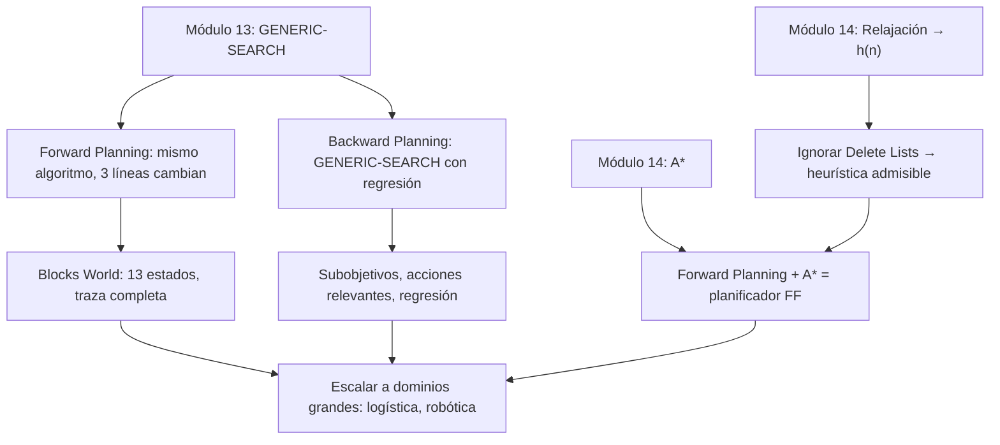

:::exam{id="EX-07" title="Parcial: Búsqueda Adversarial y Planificación Clásica" date="2026-04-08" points="10" duration="20 minutos"}
**Temas evaluados:**
- Módulo 15: Búsqueda Adversarial
- Módulo 16: Planificación Clásica
:::

:::homework{id="hw-modulos-15-16" title="Tarea Integradora: Búsqueda Adversarial y Planificación Clásica" due="2026-04-08" points="40"}
Entrega los notebooks de los módulos 15 y 16 (20 puntos por módulo):

- **Módulo 15 — Búsqueda Adversarial (20 pts):** notebooks del módulo
- **Módulo 16 — Planificación Clásica (20 pts):** notebooks del módulo

**Opciones de entrega (elige una):**

1. **Pull Request + Canvas:** Sube tu trabajo en un pull request al repositorio del curso y pega el enlace en la tarea de Canvas.
2. **Canvas directo:** Sube los archivos `.ipynb` directamente en la tarea de Canvas.
:::

# Planificación Clásica

> *"A goal without a plan is just a wish."*
> — Antoine de Saint-Exupéry

En los módulos 13 y 14 resolvimos problemas donde un agente busca un camino en un grafo **dado**: los nodos y las aristas ya existen. En el módulo 15 el grafo seguía dado, pero un oponente controlaba la mitad de las decisiones. En este módulo el grafo **no existe de antemano** — el agente lo construye sobre la marcha, describiendo estados como conjuntos de proposiciones y generando transiciones con esquemas de acción (STRIPS). El resultado es sorprendente: el algoritmo de búsqueda es **exactamente** el `GENERIC-SEARCH` del módulo 13, con solo tres líneas diferentes.

---

## Contenido

| Sección | Tema | Idea clave |
|:-------:|------|-----------|
| 16.1 | [¿Qué es planificar?](01_que_es_planificar.md) | Búsqueda vs planificación, grafo implícito, Blocks World |
| 16.2 | [STRIPS](02_strips.md) | Proposiciones, acciones (pre/add/delete), espacio de estados |
| 16.3 | [Búsqueda hacia adelante](03_busqueda_hacia_adelante.md) | Forward search = generic search + STRIPS, traza completa |
| 16.4 | [Heurísticas para planificación](04_heuristicas_planificacion.md) | Relajación: ignorar listas delete, conexión con A* |
| 16.5 | [Búsqueda hacia atrás](05_busqueda_hacia_atras.md) | Regresión, subobjetivos, forward vs backward |

---

## Materiales y flujo de trabajo

| Paso | Material | Colab | Descripción |
|:----:|---------|:-----:|-------------|
| 1 | [16.1 ¿Qué es planificar?](01_que_es_planificar.md) | — | Grafo implícito, analogía con mudanza, Blocks World |
| 2 | [16.2 STRIPS](02_strips.md) | — | Proposiciones, acciones, espacio de estados completo |
| 3 | [Notebook 01 — STRIPS y estados](notebooks/01_strips_y_estados.ipynb) | <a href="https://colab.research.google.com/github/sonder-art/ia_p26/blob/main/clase/16_planificacion_clasica/notebooks/01_strips_y_estados.ipynb" target="_blank"></a> | Representar estados y acciones en Python, generar espacio de estados |
| 4 | [16.3 Búsqueda hacia adelante](03_busqueda_hacia_adelante.md) | — | Forward search, traza BFS completa en Blocks World |
| 5 | [16.4 Heurísticas](04_heuristicas_planificacion.md) | — | Relajación, conexión con A* |
| 6 | [16.5 Búsqueda hacia atrás](05_busqueda_hacia_atras.md) | — | Regresión, subobjetivos, forward vs backward |
| 7 | [Notebook 02 — Planificación forward y backward](notebooks/02_planificacion_forward.ipynb) | <a href="https://colab.research.google.com/github/sonder-art/ia_p26/blob/main/clase/16_planificacion_clasica/notebooks/02_planificacion_forward.ipynb" target="_blank"></a> | Implementar BFS y A* forward, backward planner, comparar |
| 8 | Notebook de aplicación | — | Dominio logístico: camiones, paquetes, ciudades |

### Notebook de aplicación

| Notebook | Tema | Colab |
|---------|------|:-----:|
| [03 — Logística](notebooks/aplicaciones/03_logistica.ipynb) | Mismo framework STRIPS en un dominio diferente: camiones, paquetes, ubicaciones | <a href="https://colab.research.google.com/github/sonder-art/ia_p26/blob/main/clase/16_planificacion_clasica/notebooks/aplicaciones/03_logistica.ipynb" target="_blank"></a> |

---

## Objetivos de aprendizaje

Al terminar este módulo podrás:

1. **Distinguir** búsqueda (grafo explícito) de planificación (grafo implícito generado por acciones) y explicar por qué la planificación necesita un lenguaje de representación
2. **Representar** un problema de planificación en STRIPS: estados como conjuntos de proposiciones, acciones con precondiciones, lista add y lista delete
3. **Aplicar** una acción STRIPS a un estado: verificar precondiciones, eliminar proposiciones de la lista delete, agregar proposiciones de la lista add
4. **Implementar** búsqueda hacia adelante (forward search) y reconocer que es `GENERIC-SEARCH` del módulo 13 con tres sustituciones
5. **Trazar** la ejecución de BFS en un problema de Blocks World paso a paso, mostrando frontera, explorados y plan encontrado
6. **Explicar** la heurística de relajación (ignorar listas delete) y por qué es admisible
7. **Conectar** la planificación con A* del módulo 14: forward search + heurística relajada = planificador FF
8. **Definir** acciones relevantes y consistentes, aplicar la fórmula de regresión, y trazar la búsqueda hacia atrás
9. **Comparar** forward vs backward search: cuándo conviene cada dirección según el factor de ramificación

---

## Prerrequisitos

| Concepto | Módulo |
|----------|--------|
| Algoritmo genérico de búsqueda, BFS, DFS, frontera, conjunto explorado | [13 — Búsqueda Simple](../13_simple_search/00_index.md) |
| Heurísticas $h(n)$, admisibilidad, relajación de problemas, A* | [14 — Búsqueda Informada](../14_busqueda_informada/00_index.md) |

---

## Mapa conceptual



---

## Cómo ejecutar el script de imágenes

```bash
cd clase/16_planificacion_clasica
python3 lab_planificacion.py
```

Dependencias: `numpy`, `matplotlib` (ver `requirements.txt`).
