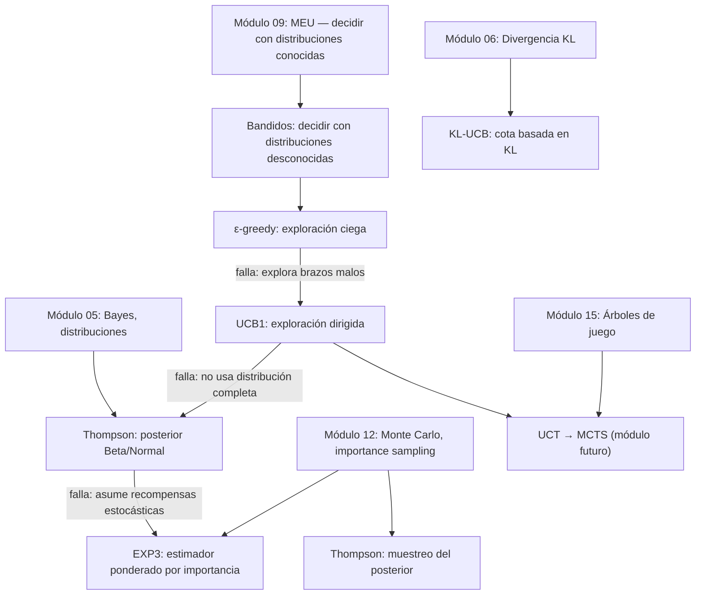

# Multi-Armed Bandits

> *"The greatest enemy of knowledge is not ignorance, it is the illusion of knowledge."* — Daniel J. Boorstin

En módulos anteriores aprendimos a tomar decisiones óptimas cuando conocemos las distribuciones relevantes (Módulo 09 — Teoría de la Decisión) y a estimar cantidades desconocidas mediante muestreo (Módulo 12 — Monte Carlo). Pero ¿qué pasa cuando debemos **tomar decisiones y aprender simultáneamente**? Cada acción produce dos cosas: una recompensa inmediata y nueva información. Elegir la acción que parece mejor *ahora* puede impedirnos descubrir una mejor; explorar demasiado desperdicia recompensas acumuladas. Este es el dilema de **exploración vs. explotación**, y el bandido multibrazo es su formalización más pura. Los algoritmos de este módulo — ε-greedy, UCB1, Thompson Sampling y EXP3 — aparecen en pruebas A/B, ensayos clínicos, sistemas de recomendación y como pieza central de Monte Carlo Tree Search.

---

## Contenido

| Sección | Tema | Idea clave |
|:-------:|------|-----------|
| 17.1 | [El dilema: exploración vs. explotación](01_el_dilema.md) | Formulación formal, regret, dos problemas canónicos |
| 17.2 | [ε-Greedy](02_epsilon_greedy.md) | La estrategia más simple; exploración ciega y sus límites |
| 17.3 | [UCB](03_ucb.md) | Optimismo ante la incertidumbre; cota de confianza como guía |
| 17.4 | [Thompson Sampling](04_thompson_sampling.md) | El enfoque bayesiano; distribución Beta y familias conjugadas |
| 17.5 | [Comparación y análisis](05_comparacion.md) | Todos los algoritmos cara a cara en ambos problemas canónicos |
| 17.6 | [Bandidos adversariales y EXP3](06_adversarial.md) | Cuando no hay distribución fija; pesos multiplicativos |
| 17.7 | [Aplicaciones y variantes](07_aplicaciones_y_variantes.md) | A/B testing, ensayos clínicos, variantes, puntero a MCTS |

---

## Materiales y flujo de trabajo

| Paso | Material | Colab | Descripción |
|:----:|---------|:-----:|-------------|
| 1 | [17.1 El dilema](01_el_dilema.md) | — | Formulación, regret, problemas canónicos |
| 2 | [17.2 ε-Greedy](02_epsilon_greedy.md) | — | Exploración aleatoria, media incremental, decaimiento |
| 3 | [Notebook 01 — Exploración básica](notebooks/01_exploracion_basica.ipynb) | <a href="https://colab.research.google.com/github/sonder-art/ia_p26/blob/main/clase/17_multi_armed_bandits/notebooks/01_exploracion_basica.ipynb" target="_blank"></a> | Construir el entorno, calcular regret, explorar sin algoritmo |
| 4 | [17.3 UCB](03_ucb.md) | — | Hoeffding, UCB1, KL-UCB, variantes |
| 5 | [Notebook 02 — Algoritmos frecuentistas](notebooks/02_frecuentistas.ipynb) | <a href="https://colab.research.google.com/github/sonder-art/ia_p26/blob/main/clase/17_multi_armed_bandits/notebooks/02_frecuentistas.ipynb" target="_blank"></a> | Implementar ε-greedy, UCB1 y KL-UCB; comparar |
| 6 | [17.4 Thompson Sampling](04_thompson_sampling.md) | — | Beta, conjugación, muestreo posterior |
| 7 | [17.5 Comparación](05_comparacion.md) | — | Gran experimento, tabla resumen, guía de uso |
| 8 | [17.6 Adversarial](06_adversarial.md) | — | EXP3, espectro estocástico–adversarial |
| 9 | [Notebook 03 — Bayesianos y comparación](notebooks/03_bayesianos_y_comparacion.ipynb) | <a href="https://colab.research.google.com/github/sonder-art/ia_p26/blob/main/clase/17_multi_armed_bandits/notebooks/03_bayesianos_y_comparacion.ipynb" target="_blank"></a> | Thompson, EXP3, comparación de todos los algoritmos |
| 10 | [17.7 Aplicaciones](07_aplicaciones_y_variantes.md) | — | A/B testing, ensayos clínicos, variantes |
| 11 | [Notebook 04 — A/B Testing](notebooks/aplicaciones/04_ab_testing.ipynb) | <a href="https://colab.research.google.com/github/sonder-art/ia_p26/blob/main/clase/17_multi_armed_bandits/notebooks/aplicaciones/04_ab_testing.ipynb" target="_blank"></a> | Prueba A/B real: tradicional vs. adaptativa |

---

## Objetivos de aprendizaje

Al terminar este módulo podrás:

1. **Formular** el problema del bandido multibrazo con sus 5 componentes y explicar por qué MEU solo no basta cuando las distribuciones son desconocidas
2. **Definir** regret acumulado y descomponerlo por brazo: $R_T = \sum_i \Delta_i N_i(T)$
3. **Implementar** ε-greedy con actualización incremental de la media y comparar esquemas de decaimiento
4. **Derivar** la fórmula de UCB1 a partir de la desigualdad de Hoeffding y explicar el principio de optimismo ante la incertidumbre
5. **Implementar** Thompson Sampling usando la conjugación Beta-Bernoulli y Normal-Normal, y explicar el mecanismo de probability matching
6. **Comparar** ε-greedy, UCB1, KL-UCB, Thompson y EXP3 en regret teórico y empírico sobre los dos problemas canónicos
7. **Explicar** por qué EXP3 funciona en entornos adversariales donde UCB1 y Thompson fallan
8. **Aplicar** bandidos a pruebas A/B y cuantificar la ventaja de la asignación adaptativa sobre el split fijo 50/50
9. **Clasificar** variantes del problema (contextual, no estacionario, combinatorial) e identificar el algoritmo apropiado para cada una

---

## Prerrequisitos

| Concepto | Módulo |
|----------|--------|
| Teorema de Bayes, esperanza, varianza, distribuciones (Bernoulli, Normal) | [05 — Probabilidad](../05_probabilidad/00_index.md) |
| Divergencia KL | [06 — Teoría de la Información](../06_teoria_de_la_informacion/00_index.md) |
| Principio MEU, matrices de decisión, funciones de utilidad | [09 — Teoría de la Decisión](../09_teoria_decision/00_index.md) |
| Estimador Monte Carlo, ley de grandes números, importance sampling | [12 — Métodos de Monte Carlo](../12_montecarlo/00_index.md) |
| Árboles de juego, minimax (para contexto de MCTS) | [15 — Búsqueda Adversarial](../15_adversarial_search/00_index.md) |

---

## Mapa conceptual



---

## Cómo ejecutar el script de imágenes

```bash
cd clase/17_multi_armed_bandits
python3 lab_bandits.py
```

Dependencias: `numpy`, `matplotlib`, `scipy` (ver `requirements.txt`).
