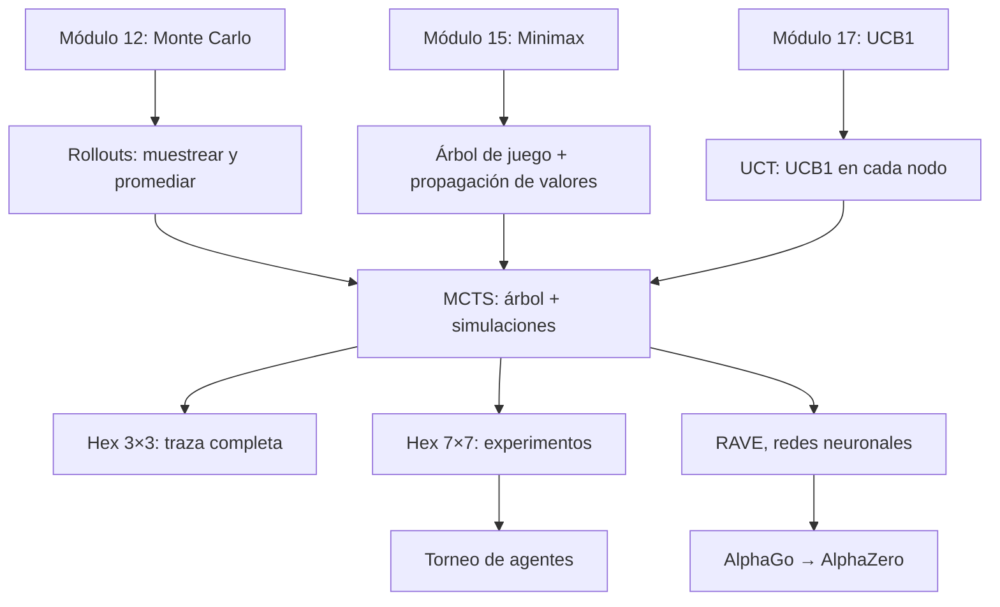

:::project{id="proyecto-hex" title="Torneo de Hex" due="2026-04-20" team_size="3" points="10"}

**Repositorio:** [ia_p26_hex_tournament](https://github.com/sonder-art/ia_p26_hex_tournament)

Implementa una estrategia que juegue Hex en un tablero 11x11 en dos variantes: **classic** (información completa) y **dark** (fog of war — solo ves tus propias piedras). Tu estrategia compite en un torneo contra tres oponentes de dificultad creciente: Random, GreedyPath y MCTS_Default.

**Entregables (via Pull Request al repositorio del torneo):**
1. `estudiantes/<tu_equipo>/strategy.py` — tu estrategia (único archivo evaluado en el torneo)
2. `estudiantes/<tu_equipo>/README.md` — explicación detallada de qué hace tu estrategia, cómo la diseñaron, qué alternativas consideraron y por qué tomaron las decisiones que tomaron

**Calificación:**

| Resultado | Puntos |
|-----------|--------|
| No gana contra ningún default | 0 |
| Gana contra Random | 6 |
| Gana contra Random + GreedyPath | 8 |
| Gana contra los tres (Random + GreedyPath + MCTS_Default) | 10 |

Los **top 3** por total de partidas ganadas reciben puntos extra.

Consulta el README del repositorio para instrucciones de setup, restricciones de recursos (10s por jugada, solo numpy + stdlib) e ideas de estrategias.

:::

# Búsqueda Monte Carlo en Árboles

> *"Instead of trying to find the perfect move, play a thousand random games and see which move wins most often."*

En el módulo 15 aprendimos a resolver juegos de forma exacta con minimax y poda alfa-beta — pero esos métodos colapsan cuando el árbol de juego es demasiado grande. En el módulo 12 descubrimos que muestrear y promediar puede estimar cualquier esperanza, y en el módulo 17 que UCB1 resuelve el balance entre exploración y explotación. Este módulo une las tres ideas: **Monte Carlo Tree Search (MCTS)** construye un árbol de forma selectiva, usa simulaciones aleatorias para evaluar posiciones y aplica la fórmula de bandidos para decidir qué ramas explorar. El resultado es un algoritmo que juega bien sin necesitar ninguna función de evaluación manual — la misma idea que llevó a AlphaGo a derrotar al campeón mundial de Go en 2016.

---

## Contenido

| Sección | Tema | Idea clave |
|:-------:|------|-----------|
| 18.1 | [Más allá de minimax](01_mas_alla_de_minimax.md) | Rollouts aleatorios como evaluación sin dominio |
| 18.2 | [Hex: el juego](02_hex.md) | Reglas, tablero, teoremas fundamentales |
| 18.3 | [MCTS: las cuatro fases](03_mcts.md) | Selección, expansión, simulación, retropropagación |
| 18.4 | [UCT: la conexión con bandidos](04_uct.md) | UCB1 aplicado a nodos del árbol |
| 18.5 | [MCTS en acción](05_mcts_en_accion.md) | Experimentos en Hex 3×3 y 7×7 |
| 18.6 | [Más allá: de MCTS a AlphaZero](06_mas_alla.md) | RAVE, redes neuronales, auto-juego |

---

## Materiales y flujo de trabajo

| Paso | Material | Colab | Descripción |
|:----:|---------|:-----:|-------------|
| 1 | [18.1 Más allá de minimax](01_mas_alla_de_minimax.md) | — | Por qué los métodos exactos fallan y cómo los rollouts los reemplazan |
| 2 | [18.2 Hex: el juego](02_hex.md) | — | Reglas, tablero, componentes formales, teoremas |
| 3 | [Notebook 01 — Hex y rollouts](notebooks/01_hex_y_rollouts.ipynb) | <a href="https://colab.research.google.com/github/sonder-art/ia_p26/blob/main/clase/18_montecarlo_search/notebooks/01_hex_y_rollouts.ipynb" target="_blank"></a> | Construir Hex, jugar partidas aleatorias, evaluación por rollouts |
| 4 | [18.3 MCTS](03_mcts.md) | — | Las cuatro fases, pseudocódigo, traza paso a paso |
| 5 | [Notebook 02 — MCTS paso a paso](notebooks/02_mcts_paso_a_paso.ipynb) | <a href="https://colab.research.google.com/github/sonder-art/ia_p26/blob/main/clase/18_montecarlo_search/notebooks/02_mcts_paso_a_paso.ipynb" target="_blank"></a> | Implementar MCTS vanilla, traza manual, visualizar el árbol |
| 6 | [18.4 UCT](04_uct.md) | — | UCB1 en árboles, constante de exploración |
| 7 | [18.5 MCTS en acción](05_mcts_en_accion.md) | — | Experimentos y comparaciones en Hex |
| 8 | [Notebook 03 — UCT y experimentos](notebooks/03_uct_y_experimentos.ipynb) | <a href="https://colab.research.google.com/github/sonder-art/ia_p26/blob/main/clase/18_montecarlo_search/notebooks/03_uct_y_experimentos.ipynb" target="_blank"></a> | UCT, presupuesto de iteraciones, ajuste de $c$ |
| 9 | [18.6 Más allá](06_mas_alla.md) | — | RAVE, AlphaGo, AlphaZero, torneo |
| 10 | [Notebook 04 — Torneo](notebooks/aplicaciones/04_torneo.ipynb) | <a href="https://colab.research.google.com/github/sonder-art/ia_p26/blob/main/clase/18_montecarlo_search/notebooks/aplicaciones/04_torneo.ipynb" target="_blank"></a> | Simulación de torneo: MCTS vs alpha-beta vs aleatorio |

---

## Objetivos de aprendizaje

Al terminar este módulo podrás:

1. **Explicar** por qué minimax y alpha-beta fallan en juegos con factor de ramificación alto y justificar la necesidad de métodos aproximados
2. **Implementar** evaluación por rollouts aleatorios y conectarla con el estimador Monte Carlo del módulo 12
3. **Describir** las reglas de Hex y por qué es un juego ideal para MCTS: sin función de evaluación conocida, sin empates, reglas simples
4. **Implementar** MCTS con las cuatro fases (selección, expansión, simulación, retropropagación) y trazar su ejecución paso a paso
5. **Derivar** la fórmula UCT como aplicación directa de UCB1 (módulo 17) a nodos de un árbol de búsqueda
6. **Analizar** el efecto de la constante de exploración $c$ y del presupuesto de iteraciones en la calidad de juego de MCTS
7. **Comparar** MCTS contra minimax, alpha-beta y jugadores aleatorios en Hex
8. **Explicar** la evolución de Deep Blue a AlphaZero como una progresión dentro del mismo marco de árbol + evaluación
9. **Diseñar** un agente de Hex basado en MCTS que compita contra otros agentes bajo restricciones de tiempo

---

## Prerrequisitos

| Concepto | Módulo |
|----------|--------|
| Estimador Monte Carlo, LLN, CLT, error $O(1/\sqrt{n})$ | [12 — Métodos de Monte Carlo](../12_montecarlo/02_fundamentos.md) |
| Minimax, alpha-beta, árbol de juego, 7 componentes formales | [15 — Búsqueda Adversarial](../15_adversarial_search/00_index.md) |
| Límite de profundidad, función de evaluación, Deep Blue → AlphaZero | [15.5 — Juegos complejos](../15_adversarial_search/05_juegos_complejos.md) |
| UCB1, exploración vs explotación, regret $O(\sqrt{K \ln T})$ | [17 — Bandidos Multibrazo](../17_multi_armed_bandits/03_ucb.md) |
| UCT como aplicación de UCB1 a árboles (introducción) | [17.7 — Aplicaciones y variantes](../17_multi_armed_bandits/07_aplicaciones_y_variantes.md) |

---

## Mapa conceptual



---

## Cómo ejecutar el script de imágenes

```bash
cd clase/18_montecarlo_search
python3 lab_mcts.py
```

Dependencias: `numpy`, `matplotlib` (ver `requirements.txt`).
