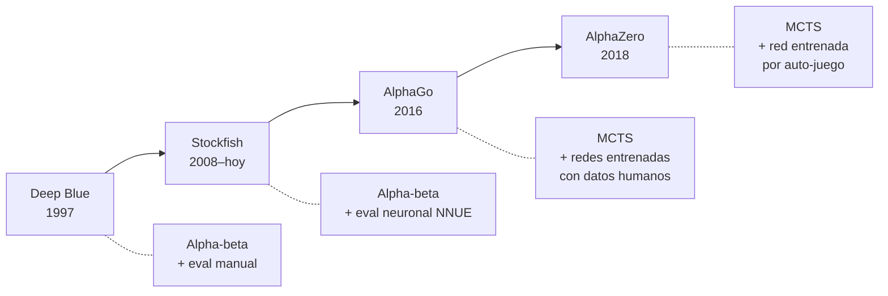

# 18.6 — Más allá: de MCTS a AlphaZero

> *"The game of Go has long been viewed as the most challenging of classic games for artificial intelligence."* — David Silver et al. (2016)

---

MCTS con UCT y rollouts aleatorios es sorprendentemente fuerte — pero tiene un límite: los rollouts aleatorios son ruidosos. En posiciones complejas, miles de partidas al azar pueden no capturar la sutileza de una posición. Esta sección presenta las mejoras que transformaron MCTS de un algoritmo prometedor en la herramienta que derrotó a los campeones mundiales.

---

## 1. RAVE: compartir información entre nodos

**Rapid Action Value Estimation** (RAVE), también conocido como AMAF (*All Moves As First*), aborda un problema práctico: al inicio, los nodos tienen muy pocas visitas y las estadísticas son poco confiables.

La idea: si la acción "jugar en $(3,4)$" aparece en un rollout — aunque sea en el movimiento 15, no en el primero — esa información es parcialmente relevante para el nodo donde $(3,4)$ es una acción inmediata.

RAVE mantiene estadísticas adicionales $Q_{\text{RAVE}}(v)$ y $N_{\text{RAVE}}(v)$ que cuentan los resultados de **todos los rollouts donde la acción de $v$ apareció**, sin importar en qué momento. La fórmula de selección combina UCT con RAVE:

$$\text{valor}(v) = (1 - \beta) \cdot \frac{Q(v)}{N(v)} + \beta \cdot \frac{Q_{\text{RAVE}}(v)}{N_{\text{RAVE}}(v)} + c\sqrt{\frac{\ln N(\text{padre})}{N(v)}}$$

donde $\beta$ decrece con las visitas: cuando $N(v)$ es bajo, RAVE domina (información compartida); cuando $N(v)$ es alto, las estadísticas propias del nodo dominan.

**Efecto práctico**: RAVE acelera la convergencia inicial de MCTS significativamente — especialmente en Go, donde el factor de ramificación es ~250 y las primeras visitas a cada nodo son escasas.

---

## 2. De rollouts aleatorios a evaluación neuronal

El siguiente salto es reemplazar los rollouts aleatorios `[M3]` por algo más informado. Hay dos enfoques:

### 2.1 Rollouts con política aprendida

En vez de elegir movimientos uniformemente al azar durante el rollout, usar una **política de rollout** entrenada: una función rápida que elige movimientos "razonables" en lugar de aleatorios. Los primeros programas fuertes de Go (como MoGo, 2006) usaban patrones locales aprendidos de partidas de expertos.

### 2.2 Red de valor: eliminar los rollouts

La idea más radical: **no hacer rollouts**. En su lugar, evaluar la posición directamente con una **red neuronal** entrenada para predecir el resultado del juego desde cualquier posición.

| | Rollouts aleatorios | Rollouts con política | Red de valor |
|---|---|---|---|
| **Conocimiento** | Ninguno | Patrones locales | Posición completa |
| **Velocidad** | ~$\mu$s por rollout | ~$\mu$s por rollout | ~ms por evaluación |
| **Calidad** | Ruidosa | Mejor | Mucho mejor |
| **Entrenamiento** | No necesita | Datos de expertos | Datos + auto-juego |
| **Rollouts necesarios** | Miles | Cientos | **Cero** |

La red de valor es más lenta por evaluación, pero como cada evaluación es mucho más precisa, se necesitan muchas menos iteraciones de MCTS para tomar buenas decisiones.

---

## 3. AlphaGo (2016): MCTS + redes neuronales

AlphaGo, desarrollado por DeepMind, combinó MCTS con dos redes neuronales:

**Red de política** $p_\sigma(a \mid s)$: predice qué movimientos jugaría un experto humano. Entrenada con millones de partidas de Go profesional. Se usa para:
- Guiar la fase de selección `[M1]` (como prior sobre qué hijos explorar primero)
- Mejorar los rollouts `[M3]` (política de rollout en lugar de aleatoria)

**Red de valor** $v_\theta(s)$: predice quién va a ganar desde la posición $s$. Entrenada primero con partidas humanas, luego refinada con auto-juego. Se usa para:
- Evaluar nodos hoja sin necesidad de rollout completo
- En la práctica, AlphaGo combinaba la evaluación de la red con rollouts: $V(s) = (1-\lambda) \cdot v_\theta(s) + \lambda \cdot \text{rollout}(s)$

**Resultado**: en marzo de 2016, AlphaGo derrotó a Lee Sedol (campeón mundial de Go) 4-1 en un match de 5 partidas. Fue la primera vez que un programa venció a un jugador profesional de Go en un tablero completo (19×19).

---

## 4. AlphaZero (2018): auto-juego puro

AlphaZero simplificó radicalmente la arquitectura de AlphaGo:

| Aspecto | AlphaGo (2016) | AlphaZero (2018) |
|---|---|---|
| **Redes** | Dos separadas (política + valor) | Una sola red con dos cabezas |
| **Datos de entrenamiento** | Millones de partidas humanas | **Ninguno** — solo auto-juego |
| **Rollouts** | Sí (combinados con red de valor) | **No** — solo red de valor |
| **Conocimiento humano** | Partidas de expertos + features manuales | **Solo las reglas del juego** |
| **Juegos** | Solo Go | Go, ajedrez y shogi |

### El ciclo de auto-juego

AlphaZero aprende desde cero con un ciclo simple:

1. **Jugar**: la red actual juega partidas contra sí misma usando MCTS con UCT (la red proporciona la política prior y la evaluación de valor)
2. **Aprender**: usar las partidas como datos de entrenamiento. La red aprende a predecir tanto la política de MCTS (qué movimientos exploró más) como el resultado final
3. **Repetir**: la nueva red juega contra sí misma, generando datos mejores. Cada ciclo produce una red más fuerte

Después de ~4 horas de auto-juego en ajedrez (usando 5000 TPUs), AlphaZero derrotó a Stockfish — el motor de ajedrez más fuerte del mundo, resultado de décadas de ingeniería humana.

---

## 5. La evolución completa

| Sistema | Año | Búsqueda | Evaluación | Datos | Resultado |
|---|:---:|---|---|---|---|
| **Deep Blue** | 1997 | Alpha-beta | Manual (~8000 features) | Ninguno | Derrotó a Kasparov |
| **Stockfish** | 2023 | Alpha-beta | NNUE (red neuronal) | Partidas + auto-juego | Motor más fuerte (código abierto) |
| **AlphaGo** | 2016 | MCTS + UCT | Redes (política + valor) | Partidas humanas + auto-juego | Derrotó a Lee Sedol (Go) |
| **AlphaZero** | 2018 | MCTS + UCT | Red dual (pol. + val.) | **Solo auto-juego** | Derrotó a Stockfish y AlphaGo |

El patrón es el mismo en todos los casos: **árbol de búsqueda + evaluación de posiciones**. Lo que evolucionó fue:
- La búsqueda: de alpha-beta (exhaustiva) a MCTS (selectiva)
- La evaluación: de manual a aprendida
- Los datos: de conocimiento humano a auto-juego

---

## 6. Tabla comparativa final

| | Minimax (§15.3) | Alpha-beta (§15.4) | MCTS + UCT (§18.3-4) | AlphaZero |
|---|---|---|---|---|
| **Búsqueda** | Exhaustiva | Exhaustiva con poda | Selectiva (asimétrica) | Selectiva + prior |
| **Evaluación** | Exacta (hojas) | Heurística `eval(s)` | Rollouts aleatorios | Red neuronal |
| **Conocimiento** | Reglas | Reglas + expertise | Solo reglas | Solo reglas |
| **Óptimo** | Sí | Sí | Asintóticamente | Asintóticamente |
| **Anytime** | No | No | Sí | Sí |
| **Complejidad** | $O(b^m)$ | $O(b^{m/2})$ | $O(M \cdot m)$ | $O(M \cdot m)$ |
| **Go** | Imposible | Imposible | Fuerte | Superhuman |
| **Ajedrez** | Imposible | Muy fuerte | Moderado | Superhuman |
| **Hex 7×7** | Imposible | Con eval | **Fuerte** | — |

---

## 7. Hacia adelante: el torneo de Hex

Los módulos 15–18 construyen una progresión:

| Módulo | Herramienta | Limitación |
|:---:|---|---|
| 15 | Minimax, alpha-beta | Requieren árbol completo o eval manual |
| 17 | UCB1, Thompson Sampling | Un solo nivel de decisiones |
| 18 | MCTS + UCT | Árboles grandes, sin eval, anytime |

Todo esto converge en una pregunta práctica: **¿qué tan buen agente de Hex puedes construir?**

En un proyecto futuro, cada estudiante implementará un agente de Hex que compita en un torneo round-robin. El formato: Hex 7×7, cada agente tiene 1 segundo por movimiento, todos contra todos. El agente recibe el estado del juego y debe retornar una acción dentro del tiempo límite — la interfaz es una función `elegir_accion(estado, tiempo_limite)`. El ranking final se basa en victorias totales, como una liga de fútbol.

Las herramientas están sobre la mesa: MCTS con UCT es la base, pero hay mucho espacio para innovar — ajustar $c$, implementar RAVE, mejorar la política de rollout, reutilizar el árbol entre movimientos, o incluso entrenar una red de valor simple. La teoría de los módulos 12, 15 y 17 es el fundamento; la creatividad del estudiante determina el resultado.

---

## Resumen del módulo

| Sección | Tema | Idea central |
|---------|------|-------------|
| 18.1 | Más allá de minimax | Los rollouts aleatorios evalúan posiciones sin dominio — son el estimador MC del módulo 12 |
| 18.2 | Hex: el juego | Reglas simples, sin empates, sin eval conocido — el juego ideal para MCTS |
| 18.3 | MCTS | Cuatro fases: selección, expansión, simulación, retropropagación |
| 18.4 | UCT | UCB1 (módulo 17) aplicado a la selección → exploración eficiente del árbol |
| 18.5 | MCTS en acción | Convergencia en 3×3, dominio sobre alpha-beta en 7×7, efecto de $c$ e iteraciones |
| 18.6 | Más allá | De rollouts a redes neuronales: AlphaGo → AlphaZero |

Las tres ideas fundamentales del módulo:

1. **Simulación como evaluación**: no necesitas saber qué es una buena posición — solo necesitas las reglas del juego y la capacidad de simular partidas aleatorias
2. **Búsqueda selectiva**: MCTS invierte su presupuesto donde importa, a diferencia de minimax que explora uniformemente. El árbol asimétrico es una señal de inteligencia
3. **La conexión UCB1 → UCT**: el balance exploración-explotación del módulo 17 es *exactamente* lo que hace funcionar la selección de MCTS. Los bandidos multibrazo no son un tema aislado — son la pieza clave del algoritmo que derrotó al campeón mundial de Go
