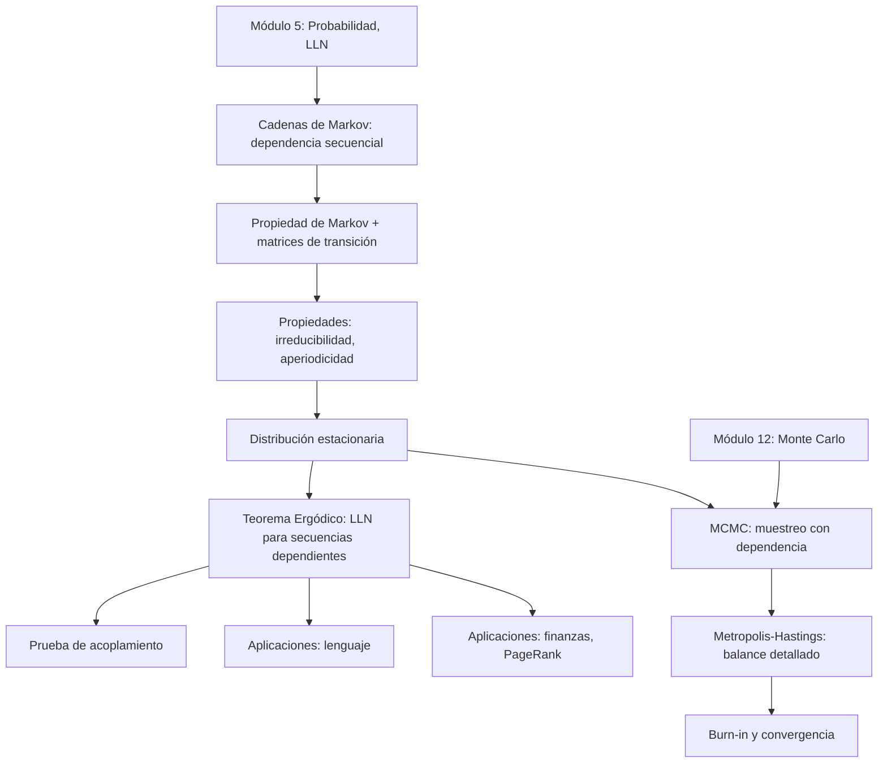

# Cadenas de Markov

> *"I was drawn to this investigation not by applications, but by the desire to show, with a clear example, that the results derived under the assumption of independence can also be obtained without it."* — A.A. Markov, 1913

En el módulo 5 construimos las bases de probabilidad — esperanza, varianza, la Ley de los Grandes Números — y en el módulo 12 las usamos para estimar integrales con Monte Carlo. Ambos módulos asumían muestras **independientes**: cada observación no sabía nada de la anterior. Este módulo rompe esa suposición. En una cadena de Markov, cada valor depende del anterior, y aun así el promedio converge. El teorema ergódico demuestra que secuencias dependientes pueden comportarse, a largo plazo, como si fueran independientes. Esta idea conecta directamente con MCMC, el motor detrás de la inferencia bayesiana moderna.

---

## Contenido

| Sección | Tema | Idea clave |
|:-------:|------|-----------|
| 19.1 | [Historia y motivación](01_historia.md) | Markov, Nekrasov, el origen de las cadenas |
| 19.2 | [Cadenas de Markov](02_cadenas_de_markov.md) | Definición, propiedad de Markov, matrices de transición |
| 19.3 | [Propiedades](03_propiedades.md) | Irreducibilidad, aperiodicidad, distribución estacionaria |
| 19.4 | [Teorema Ergódico](04_teorema_ergodico.md) | LLN para secuencias dependientes, prueba de acoplamiento |
| 19.5 | [Aplicaciones](05_aplicaciones.md) | Lenguaje, finanzas, PageRank |
| 19.6 | [MCMC](06_mcmc.md) | Metropolis-Hastings, balance detallado, burn-in |

---

## Materiales y flujo de trabajo

| Paso | Material | Colab | Descripción |
|:----:|---------|:-----:|-------------|
| 1 | [19.1 Historia y motivación](01_historia.md) | — | Markov, Nekrasov, el origen de las cadenas |
| 2 | [19.2 Cadenas de Markov](02_cadenas_de_markov.md) | — | Definición, propiedad de Markov, matrices de transición |
| 3 | [19.3 Propiedades](03_propiedades.md) | — | Irreducibilidad, aperiodicidad, distribución estacionaria |
| 4 | [Notebook 01 — Cadenas y simulación](notebooks/01_cadenas_y_simulacion.ipynb) | <a href="https://colab.research.google.com/github/sonder-art/ia_p26/blob/main/clase/19_cadenas_de_markov/notebooks/01_cadenas_y_simulacion.ipynb" target="_blank"></a> | Construir cadenas, simular trayectorias, visualizar matrices de transición |
| 5 | [19.4 Teorema Ergódico](04_teorema_ergodico.md) | — | LLN para secuencias dependientes, prueba de acoplamiento |
| 6 | [Notebook 02 — Ergodicidad](notebooks/02_ergodicidad.ipynb) | <a href="https://colab.research.google.com/github/sonder-art/ia_p26/blob/main/clase/19_cadenas_de_markov/notebooks/02_ergodicidad.ipynb" target="_blank"></a> | Verificar convergencia a la distribución estacionaria y el teorema ergódico |
| 7 | [19.5 Aplicaciones](05_aplicaciones.md) | — | Lenguaje, finanzas, PageRank |
| 8 | [19.6 MCMC](06_mcmc.md) | — | Metropolis-Hastings, balance detallado, burn-in |
| 9 | Notebook de aplicación (elige uno) | — | Exploración profunda en un dominio concreto |

### Notebooks de aplicación

Elige **uno** de los siguientes:

| Notebook | Tema | Colab |
|---------|------|:-----:|
| [03 — Letras y lenguaje](notebooks/aplicaciones/03_letras_y_lenguaje.ipynb) | Cadenas sobre texto: bigramas, generación de palabras, detección de idioma | <a href="https://colab.research.google.com/github/sonder-art/ia_p26/blob/main/clase/19_cadenas_de_markov/notebooks/aplicaciones/03_letras_y_lenguaje.ipynb" target="_blank"></a> |
| [04 — Mercados financieros](notebooks/aplicaciones/04_mercados_financieros.ipynb) | Régimenes de mercado como estados ocultos, matrices de transición empíricas | <a href="https://colab.research.google.com/github/sonder-art/ia_p26/blob/main/clase/19_cadenas_de_markov/notebooks/aplicaciones/04_mercados_financieros.ipynb" target="_blank"></a> |

---

## Objetivos de aprendizaje

Al terminar este módulo podrás:

1. **Modelar** un proceso secuencial como cadena de Markov, identificando estados y transiciones
2. **Construir** la matriz de transición a partir de datos o de una descripción del proceso
3. **Verificar** si una cadena es irreducible y aperiódica, y explicar por qué ambas propiedades importan
4. **Calcular** la distribución estacionaria resolviendo el sistema lineal correspondiente
5. **Enunciar** el teorema ergódico e interpretar su significado como LLN para secuencias dependientes
6. **Explicar** intuitivamente la prueba de acoplamiento y por qué garantiza convergencia
7. **Simular** trayectorias de una cadena de Markov y verificar empíricamente la convergencia ergódica
8. **Aplicar** cadenas de Markov a problemas de lenguaje (bigramas, generación de texto) y finanzas (régimenes de mercado)
9. **Conectar** la distribución estacionaria con el algoritmo Metropolis-Hastings y el concepto de balance detallado
10. **Distinguir** el rol de burn-in en MCMC y su relación con la velocidad de convergencia de la cadena

---

## Prerrequisitos

| Concepto | Módulo |
|----------|--------|
| Esperanza, varianza, Ley de los Grandes Números | [05 — Probabilidad](../05_probabilidad/00_index.md) |
| Estimador Monte Carlo, error &#36;O(1/\sqrt{n})&#36; | [12 — Monte Carlo](../12_monte_carlo/00_index.md) |

---

## Mapa conceptual



---

## Cómo ejecutar el script de imágenes

```bash
cd clase/19_cadenas_de_markov
python3 lab_markov.py
```

Dependencias: `numpy`, `matplotlib` (ver `requirements.txt`).
