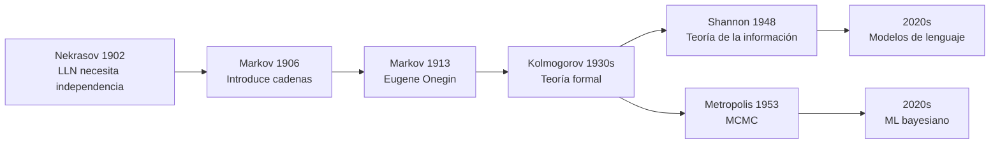

# La disputa que creó una teoría

> *"I was drawn to this investigation not by applications, but by the desire to show, with a particularly clear example, that the mathematical results derived under the assumption of independence can also be obtained without that assumption."*
> — A.A. Markov, 1913

---

## 1. Rusia, 1902: un teólogo publica un artículo de matemáticas

En el invierno de 1902, **Pavel Nekrasov** — profesor de matemáticas en la Universidad de Moscú, devoto ortodoxo, miembro prominente de la Sociedad Matemática de Moscú — publicó un artículo que pretendía demostrar la existencia de Dios con herramientas de probabilidad.

El argumento de Nekrasov era una cadena de deducciones que parecía, superficialmente, irrefutable:

1. La **Ley de los Grandes Números** (que los estudiantes de este curso ya conocen del Módulo 5) requiere que los eventos sean **independientes**.
2. Las acciones humanas son eventos que obedecen la Ley de los Grandes Números — las estadísticas de crímenes, nacimientos, matrimonios convergen a promedios estables año tras año.
3. Por lo tanto, las acciones humanas deben ser independientes entre sí.
4. Independencia de las acciones humanas = **libre albedrío**: cada persona decide sin estar determinada por lo que hicieron los demás.
5. El libre albedrío es un **don divino**.
6. Conclusión: la Ley de los Grandes Números es una demostración matemática de la existencia de Dios y del libre albedrío que Él otorga.

Esto no era una excentricidad marginal. Nekrasov era un matemático respetado, sus artículos aparecían en revistas serias, y la escuela de Moscú — dominada por figuras cercanas a la Iglesia Ortodoxa — lo citaba con aprobación. En la Rusia zarista, donde la ortodoxia religiosa tenía peso institucional, mezclar teología y matemáticas no era inusual; era, para muchos, natural.

El error matemático era profundo pero sutil: Nekrasov confundió una condición **suficiente** con una condición **necesaria**. La independencia es *suficiente* para que se cumpla la Ley de los Grandes Números — si los eventos son independientes, el promedio converge. Pero Nekrasov asumió que la independencia era *necesaria* — que sin independencia, la ley no podía funcionar. Toda su cadena de razonamiento dependía de esa confusión.

Y a 700 kilómetros de distancia, en San Petersburgo, alguien leyó el artículo con furia creciente.

---

## 2. San Petersburgo: Markov lee el artículo

**Andrei Andreevich Markov** era, en casi todos los sentidos, el opuesto de Nekrasov. Profesor en la Universidad de San Petersburgo, discípulo de Chebyshev, uno de los algebristas y probabilistas más finos de Rusia. Pero su reputación no venía solo de sus teoremas — venía de su carácter.

Markov era combativo, obstinado, y absolutamente incapaz de tolerar lo que él consideraba deshonestidad intelectual. Socialista en una Rusia zarista, ateo declarado en un país donde la Iglesia Ortodoxa era prácticamente una rama del gobierno. No era un hombre que guardara silencio:

- **Renunció públicamente** a la Iglesia Ortodoxa Rusa, un acto que en la Rusia de 1900 era socialmente devastador.
- **Se opuso al Zar** en cuestiones de política universitaria y libertad académica, arriesgando su carrera.
- **Rechazó honores** del establishment cuando consideró que venían con compromisos intelectuales.
- Cuando la Academia de Ciencias de San Petersburgo eligió a un candidato que Markov consideraba indigno, escribió cartas públicas de protesta tan virulentas que casi lo expulsan.

Cuando leyó el artículo de Nekrasov, la reacción fue inmediata: *"Esto es una vergüenza para las matemáticas."* No le molestaba la teología en sí — le molestaba que un matemático profesional confundiera suficiencia con necesidad y usara el prestigio de las matemáticas para vender una conclusión filosófica injustificada.

Pero Markov no iba a responder con filosofía. Iba a responder con un **contraejemplo matemático**. Si podía construir una secuencia de eventos *dependientes* que aún obedeciera la Ley de los Grandes Números, el argumento entero de Nekrasov se derrumbaba — y con él, su "demostración" del libre albedrío y de Dios.

---

## 3. El contraataque de Markov (1906-1913)

### 1906: la teoría

En 1906, Markov publicó un artículo que introdujo lo que él llamó **"cadenas de eventos enlazados"** (*tsepnye sobytiya*) — secuencias donde el resultado en el tiempo $t+1$ depende del resultado en el tiempo $t$, pero *no* de resultados anteriores. En notación moderna:

$$P(X_{t+1} = j \mid X_t = i, X_{t-1}, \ldots, X_0) = P(X_{t+1} = j \mid X_t = i)$$

Estas secuencias son **dependientes** por construcción — cada evento está ligado al anterior. No hay independencia. Y sin embargo, Markov demostró que bajo ciertas condiciones (lo que hoy llamamos **ergodicidad** — la cadena puede llegar a cualquier estado desde cualquier otro, y no queda atrapada en ciclos), la Ley de los Grandes Números sigue valiendo:

$$\frac{1}{n}\sum_{t=1}^n f(X_t) \xrightarrow{n \to \infty} \sum_{i \in S} f(i)\,\pi(i)$$

donde $\pi$ es la distribución estacionaria de la cadena. El promedio de cualquier función a lo largo de la trayectoria converge a su valor esperado bajo $\pi$, sin importar que las muestras sean dependientes.

La refutación era completa y devastadora. La independencia **no es necesaria** para la Ley de los Grandes Números. Nekrasov estaba matemáticamente equivocado, y todo su edificio teológico se derrumbaba con un solo contraejemplo.

### 1913: la demostración empírica — Eugene Onegin

Pero Markov no se conformó con la teoría. En 1913, realizó lo que hoy reconocemos como el **primer análisis empírico de una cadena de Markov en la historia**: un estudio estadístico del texto de *Eugene Onegin*, la novela en verso de Alexander Pushkin, considerada la obra cumbre de la literatura rusa.

El procedimiento fue meticuloso y artesanal — no había computadoras en 1913:

1. Tomó los primeros **20,000 caracteres** del texto de Pushkin.
2. Clasificó cada carácter como **vocal (V)** o **consonante (C)**, descartando espacios y puntuación.
3. Contó las transiciones entre tipos consecutivos:
   - ¿Cuántas veces una vocal es seguida por otra vocal? (V $\to$ V)
   - ¿Cuántas veces una vocal es seguida por una consonante? (V $\to$ C)
   - ¿Cuántas veces una consonante es seguida por una vocal? (C $\to$ V)
   - ¿Cuántas veces una consonante es seguida por otra consonante? (C $\to$ C)
4. Construyó la **matriz de transición** $2 \times 2$ a partir de las frecuencias observadas.

Los resultados mostraron exactamente lo que Markov necesitaba. En el texto de Pushkin, aproximadamente el **43% de los caracteres eran vocales** y el **57% consonantes**. Pero lo crucial eran las transiciones: después de una vocal, la probabilidad de otra vocal era notablemente menor que después de una consonante. El ruso tiene estructura fonética — las vocales y consonantes se alternan con patrones claros. La dependencia era **obvia e innegable**.

Y sin embargo, las frecuencias a largo plazo convergían a valores estables exactamente como predecía la teoría. La Ley de los Grandes Números funcionaba perfectamente sobre esta secuencia dependiente. El promedio muestral de "fracción de vocales" convergía al valor de la distribución estacionaria, no porque los caracteres fueran independientes, sino porque la cadena era ergódica.

Markov había construido el argumento más elegante posible: un contraejemplo que era simultáneamente riguroso, empírico, y literario. No solo refutó a Nekrasov — demostró que la dependencia secuencial, lejos de destruir la regularidad estadística, la preserva bajo condiciones bien definidas.

---

## 4. El legado

Nekrasov nunca aceptó la refutación. La disputa continuó durante años a través de cartas, artículos, y comunicaciones a la Academia — un intercambio cada vez más amargo donde Nekrasov intentaba defender su posición con argumentos filosóficos mientras Markov respondía con teoremas. Nekrasov murió en 1924 sin haber cedido un centímetro.

Pero la matemática no se decide por terquedad. Markov había demostrado su punto, y las "cadenas de eventos enlazados" que creó como arma en una disputa teológica se convirtieron en una de las herramientas matemáticas más importantes del siglo XX:

- **Kolmogorov (1930s):** formalizó la teoría de la probabilidad axiomáticamente, y el marco de Markov fue central. Las cadenas de Markov se convirtieron en el ejemplo prototípico de proceso estocástico.
- **Shannon (1948):** usó cadenas de Markov como la base de la **teoría de la información**. Su artículo fundacional, *A Mathematical Theory of Communication*, modela el lenguaje humano como una cadena de Markov — exactamente la misma idea que Markov había tenido con Pushkin 35 años antes.
- **Metropolis (1953):** diseñó cadenas de Markov *a medida* para muestrear de distribuciones complicadas — el nacimiento de **MCMC** (Markov Chain Monte Carlo), que conecta directamente con el método Monte Carlo del Módulo 12.
- **Hoy:** PageRank (Google modela la web como una cadena de Markov gigante), reconocimiento de voz, genómica, finanzas cuantitativas, modelos de lenguaje, aprendizaje por refuerzo, inferencia bayesiana.

La ironía es extraordinaria: una herramienta creada para ganar un argumento sobre Dios se convirtió en una de las invenciones matemáticas más prácticas de la historia. Markov no estaba buscando aplicaciones — estaba buscando un contraejemplo. Pero las ideas matemáticas genuinas tienen una forma de trascender las motivaciones de sus creadores.

---

## 5. Los protagonistas

| Protagonista | Posición | Motivación |
|:---:|---------|------|
| **Pavel Nekrasov** | LLN requiere independencia $\to$ libre albedrío $\to$ Dios | Teología como matemáticas |
| **Andrei Markov** | LLN funciona con dependencia $\to$ las cadenas lo demuestran | Defensa del rigor matemático |

La siguiente sección define formalmente qué es una cadena de Markov, construye la matriz de transición, y establece la propiedad que lleva su nombre.

---

**[← Índice](00_index.md)** · **Siguiente:** [Cadenas de Markov →](02_cadenas_de_markov.md)
