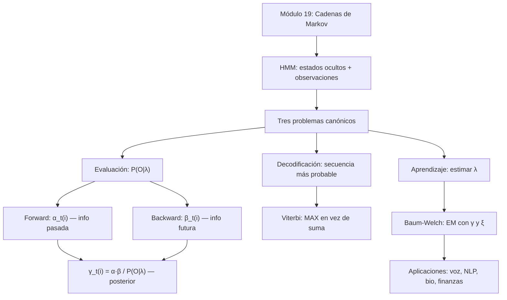

# Modelos Ocultos de Markov

> *"La realidad que ves no es la única realidad."* — Serial Experiments Lain

En el módulo 19 aprendimos que las cadenas de Markov describen secuencias donde **el estado es visible**: sabemos exactamente en qué estado estamos en cada momento. Pero muchos sistemas del mundo real no funcionan así. El clima real que experimenta Lain no se puede observar directamente — solo se ven sus consecuencias (¿trae paraguas o no?). El estado oculto genera las observaciones visibles, y nuestra tarea es razonar sobre lo invisible a partir de lo visible.

Eso es exactamente lo que resuelven los **Modelos Ocultos de Markov (HMM)**.

---


## Tres preguntas, un modelo

Un HMM bien definido permite responder tres tipos de preguntas fundamentales:

| Problema | Pregunta | Algoritmo |
|:--------:|----------|-----------|
| **Evaluación** | ¿Cuál es la probabilidad de que este modelo haya generado esta secuencia de observaciones? | Forward / Backward |
| **Decodificación** | Dada la secuencia de observaciones, ¿cuál es la secuencia de estados ocultos más probable? | Viterbi |
| **Aprendizaje** | Dados solo los datos de observaciones, ¿cómo ajustamos los parámetros del modelo? | Baum-Welch |

---

## Contenido

| Sección | Tema | Idea clave |
|:-------:|------|-----------|
| 20.1 | [El problema y el modelo](01_el_problema.md) | Dos capas: estados ocultos + observaciones |
| 20.2 | [Algoritmo Forward](02_forward.md) | Probabilidad de la secuencia en tiempo O(N²T) |
| 20.3 | [Algoritmo Backward](03_backward.md) | Información futura; combinado con Forward → posteriors |
| 20.4 | [Algoritmo de Viterbi](04_viterbi.md) | Secuencia de estados ocultos más probable |
| 20.5 | [Baum-Welch](05_baum_welch.md) | Aprender parámetros con EM |
| 20.6 | [Aplicaciones](06_aplicaciones.md) | Reconocimiento de voz, NLP, bioinformática, finanzas |

---

## Materiales y flujo de trabajo

| Paso | Material | Colab | Descripción |
|:----:|---------|:-----:|-------------|
| 1 | [20.1 El problema](01_el_problema.md) | — | HMM: dos capas, parámetros, ejemplo de Lain |
| 2 | [20.2 Forward](02_forward.md) | — | Evaluación de secuencias; traza completa |
| 3 | [20.3 Backward](03_backward.md) | — | Información hacia atrás; posteriors γ |
| 4 | [Notebook 01 — Inferencia HMM](notebooks/01_inferencia_hmm.ipynb) | <a href="https://colab.research.google.com/github/sonder-art/ia_p26/blob/main/clase/20_hmm/notebooks/01_inferencia_hmm.ipynb" target="_blank"></a> | Implementar Forward, Backward, Viterbi; verificar contra traza |
| 5 | [20.4 Viterbi](04_viterbi.md) | — | Decodificación; traza con backpointers |
| 6 | [20.5 Baum-Welch](05_baum_welch.md) | — | Aprendizaje EM; una iteración completa |
| 7 | [Notebook 02 — Baum-Welch](notebooks/02_baum_welch.ipynb) | <a href="https://colab.research.google.com/github/sonder-art/ia_p26/blob/main/clase/20_hmm/notebooks/02_baum_welch.ipynb" target="_blank"></a> | Convergencia, underflow, implementación en log-espacio |
| 8 | [20.6 Aplicaciones](06_aplicaciones.md) | — | Cuatro dominios reales |
| 9 | [Notebook 03 — Aplicaciones](notebooks/aplicaciones/03_aplicaciones.ipynb) | <a href="https://colab.research.google.com/github/sonder-art/ia_p26/blob/main/clase/20_hmm/notebooks/aplicaciones/03_aplicaciones.ipynb" target="_blank"></a> | POS tagging con HMM; Viterbi sobre oraciones reales |

---

## Objetivos de aprendizaje

Al terminar este módulo podrás:

1. **Explicar** la diferencia entre una cadena de Markov y un HMM, identificando las dos capas del modelo
2. **Escribir** los parámetros completos de un HMM: π, A, B — y traducirlos a lenguaje natural
3. **Calcular** manualmente la probabilidad de una secuencia de observaciones con el algoritmo Forward
4. **Calcular** manualmente los valores β con el algoritmo Backward y verificar que coincide con Forward
5. **Combinar** Forward y Backward para obtener las probabilidades posteriores γ_t(i)
6. **Ejecutar** el algoritmo de Viterbi paso a paso, incluyendo el rastreo de backpointers
7. **Describir** el ciclo E-M de Baum-Welch: qué calcula el E-paso y qué actualiza el M-paso
8. **Identificar** el problema de underflow numérico y explicar por qué se usa log-espacio
9. **Aplicar** HMMs a un dominio concreto (NLP, bioinformática, finanzas)

---

## Prerrequisitos

| Concepto | Módulo |
|----------|--------|
| Probabilidad condicional, Bayes, distribuciones | [05 — Probabilidad](../05_probabilidad/00_index.md) |
| Cadenas de Markov, propiedad de Markov, distribución estacionaria | [19 — Cadenas de Markov](../19_cadenas_de_markov/00_index.md) |

---

## Mapa conceptual



---

## Cómo ejecutar el script de imágenes

```bash
cd clase/20_hmm
python3 lab_hmm.py
```

Dependencias: `numpy`, `matplotlib` (ver `requirements.txt`).
