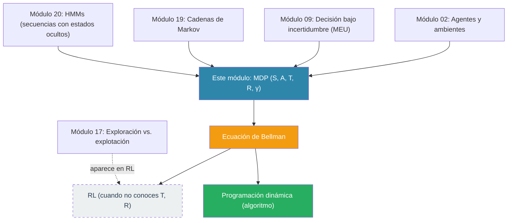

# Programación Dinámica y la Ecuación de Bellman

> *"An optimal policy has the property that whatever the initial state and initial decision are, the remaining decisions must constitute an optimal policy with respect to the state resulting from the first decision."* — Richard Bellman, 1957

---

Hasta ahora el curso te ha enseñado a decidir **una vez** (Módulo 9 — Teoría de la Decisión) y a modelar **cómo evoluciona un sistema** (Módulos 19 y 20 — Cadenas de Markov y HMMs). Pero las decisiones importantes raras veces son aisladas. Un robot que navega, un inversionista que planea, un doctor que trata un paciente crónico: todos deciden **muchas veces, en secuencia**, y cada decisión cambia el espacio de decisiones que les toca enfrentar después.

Este módulo te enseña la herramienta que Richard Bellman inventó en los años 50 para pensar exactamente este tipo de problemas: **la optimización dinámica**. Son dos ideas distintas que vamos a separar con cuidado:

1. **El principio de optimalidad** — una observación estructural sobre cómo se ven las decisiones óptimas en secuencias.
2. **La programación dinámica** — una técnica computacional que aprovecha esa estructura.

La primera da una ecuación (la *ecuación de Bellman*). La segunda da un algoritmo. Confundirlas es la fuente de mucha confusión cuando se estudia aprendizaje por refuerzo más adelante. Aquí las vas a poder distinguir.

---

## ¿Qué vas a poder hacer al terminar este módulo?

1. **Explicar** por qué las decisiones secuenciales no se pueden optimizar paso a paso.
2. **Enunciar** el principio de optimalidad de Bellman con tus propias palabras.
3. **Formular** un problema de decisión secuencial como un MDP — nombrar sus estados, acciones, transiciones, recompensas y factor de descuento — y **escribir la ecuación de Bellman** especializada a ese problema.
4. **Calcular** la función de valor óptima y extraer una política óptima a mano, llenando la tabla de valores desde la meta hasta el inicio.
5. **Distinguir** la *ecuación de Bellman* (una condición estructural que $V^*$ debe satisfacer) de la *programación dinámica* (una técnica para encontrar $V^*$).

---

## Estructura del módulo

Este módulo está dividido en dos partes con propósitos pedagógicos distintos:

| Parte | Páginas | Propósito |
|:-----:|:-------:|-----------|
| **Parte I — Bellman como optimización dinámica** | 21.1, 21.2, 21.3 | Entender la ecuación: qué dice, de dónde sale, cómo la escribes para un problema nuevo. |
| **Parte II — Programación Dinámica en detalle** | 21.4 | Entender el algoritmo que resuelve la ecuación eficientemente. |
| **Cierre** | 21.5 | Consolidación, mapa de conexiones, puerta hacia lo que viene. |

---

## Contenido

| Sección | Tema | Idea clave |
|:-------:|------|-----------|
| 21.1 | [El principio de optimalidad](01_principio_optimalidad.md) | Decidir hoy cambia lo que puedes decidir mañana — por eso las secuencias resisten la optimización miope. |
| 21.2 | [La escalera y la ecuación de Bellman](02_escalera_bellman.md) | Un ejemplo que llenamos a mano; la ecuación emerge sola. Determinista → estocástico → con descuento $\gamma$. |
| 21.3 | [Formular problemas como MDP](03_formular_problemas.md) | El vocabulario $(S, A, T, R, \gamma)$. Dos ejercicios: robot con batería, excursionista bajo lluvia. |
| 21.4 | [Programación dinámica en detalle](04_programacion_dinamica.md) | Recursión ingenua vs. DP. Memoización, tabulación, DAG de subproblemas, complejidad, extracción de política. |
| 21.5 | [Cierre y consolidación](05_cierre.md) | La distinción principio-vs-técnica. Mapa de conexiones. La pregunta que contesta RL. |

---

## Materiales y flujo de trabajo

| Paso | Material | Colab | Descripción |
|:----:|---------|:-----:|-------------|
| 1 | [21.1 Principio de optimalidad](01_principio_optimalidad.md) | — | Intuición: por qué las secuencias son difíciles |
| 2 | [21.2 Escalera y Bellman](02_escalera_bellman.md) | — | Llenar la tabla a mano; descubrir la ecuación |
| 3 | [Notebook 01 — Escalera a mano](notebooks/01_escalera_a_mano.ipynb) | <a href="https://colab.research.google.com/github/sonder-art/ia_p26/blob/main/clase/21_programacion_dinamica/notebooks/01_escalera_a_mano.ipynb" target="_blank"></a> | Verificar tu traza a mano con código; extensión estocástica |
| 4 | [21.3 Formular problemas](03_formular_problemas.md) | — | Vocabulario MDP + dos ejercicios de modelado |
| 5 | [21.4 Programación dinámica](04_programacion_dinamica.md) | — | Del principio al algoritmo — cómo calcular $V^*$ eficientemente |
| 6 | [Notebook 02 — Implementación DP](notebooks/02_dp_implementacion.ipynb) | <a href="https://colab.research.google.com/github/sonder-art/ia_p26/blob/main/clase/21_programacion_dinamica/notebooks/02_dp_implementacion.ipynb" target="_blank"></a> | Implementar las tres versiones; medir la brecha exponencial vs lineal |
| 7 | [21.5 Cierre](05_cierre.md) | — | Consolidación y mapa hacia lo que sigue |

---

## Prerrequisitos — herramientas que vas a *reusar*, no solo reconocer

Este módulo es acumulativo. Cada uno de los siguientes conceptos anteriores reaparece aquí como una herramienta activa, no como telón de fondo:

| Concepto | Módulo | Cómo reaparece aquí |
|----------|--------|---------------------|
| Agente, ambiente, objetivo (PEAS) | [02 — Agentes & Ambientes](../02_agentes_&_ambientes/00_index.md) | El vocabulario MDP extiende el marco de agentes al caso secuencial; aparece explícitamente en el ejercicio del robot |
| Utilidad esperada, principio MEU | [09 — Teoría de la Decisión](../09_teoria_decision/00_index.md) | La ecuación de Bellman *extiende* MEU al caso secuencial con descuento |
| Exploración vs. explotación | [17 — Multi-Armed Bandits](../17_multi_armed_bandits/00_index.md) | Hoy asumimos que conocemos costos y transiciones; esa asunción se romperá cuando lleguemos a RL, y ahí este dilema reaparecerá |
| Cadenas de Markov | [19 — Cadenas de Markov](../19_cadenas_de_markov/00_index.md) | Viven dentro del kernel de transición $T(s, a)$; aparecen explícitamente en el ejercicio del excursionista |
| Modelos ocultos de Markov | [20 — HMMs](../20_hmm/00_index.md) | Mismo marco secuencial, pero con estados ocultos; aquí asumimos estado observable y añadimos la capa de decisión |

---

## Mapa conceptual



Todo lo sólido de este módulo alimenta la ecuación de Bellman. Todo lo punteado (RL) es lo que vamos a construir **después** de pasar por aprendizaje automático y redes neuronales — usando esta misma ecuación.

---

## Cómo ejecutar el script de imágenes

```bash
cd clase/21_programacion_dinamica
python3 lab_bellman_dp.py
```

Dependencias: `numpy`, `matplotlib` (ver `requirements.txt`).

---

**Siguiente:** [El principio de optimalidad →](01_principio_optimalidad.md)
