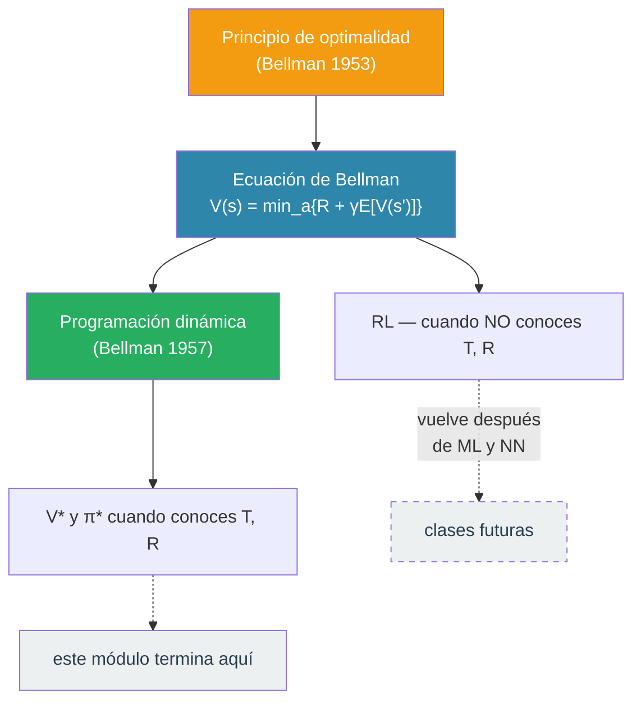

# 21.5 — Cierre y consolidación

> *"Lo que descubres al final de un módulo no es material nuevo: es el mapa que te permite ver todo lo anterior de golpe."*

---

## Lo que probamos vs. lo que calculamos

Este módulo hizo dos cosas radicalmente distintas, y vale la pena tenerlas separadas en tu cabeza. Si cuando termines de leer esta sección puedes decir la frase siguiente sin pestañear, el módulo cumplió su objetivo:

> **La ecuación de Bellman es una *condición estructural* que la función de valor óptima debe satisfacer; la programación dinámica es una *técnica computacional* que encuentra la función de valor explotando esa condición.**

Ambas son ideas de Richard Bellman. Ambas son útiles. Son **distintas**. La ecuación dice *qué buscar*; el algoritmo dice *cómo buscarlo*.

Por qué importa la distinción: en unos módulos vamos a encontrar problemas donde **la ecuación de Bellman sigue siendo válida, pero la programación dinámica ya no es aplicable**. Eso no es contradicción — es que el principio (la ecuación) y la técnica (DP) son objetos diferentes. Resolver un problema cambia cuando cambias la técnica, aunque el principio persista.

---

## Qué reapareció de los módulos anteriores

Este módulo no apareció de la nada. Fue una síntesis. Cada uno de los siguientes conceptos, que ya habías visto, se convirtió aquí en una herramienta activa:

| Módulo | Qué trajiste | Dónde apareció en este módulo |
|--------|--------------|-------------------------------|
| **02 — Agentes & Ambientes** | Marco PEAS (Performance, Environment, Actuators, Sensors) | En el ejercicio del robot: los cinco componentes del MDP son la versión formal de PEAS para decisiones secuenciales |
| **09 — Teoría de la Decisión** | Principio MEU (máxima utilidad esperada) para decisiones de un solo tiro | La ecuación de Bellman es MEU aplicado recursivamente — en cada estado, eliges la acción que maximiza utilidad esperada, pero donde "utilidad" incluye los valores futuros |
| **17 — Multi-Armed Bandits** | Dilema exploración vs. explotación | Aquí **no** apareció, porque asumimos que conocemos las transiciones y los costos. En RL esta suposición se rompe y el dilema regresa — ahora en espacio de estados, no solo de acciones |
| **19 — Cadenas de Markov** | Matriz de transición, propiedad de Markov | Viven dentro de $T(s' \mid s, a)$; aparecen explícitamente en el ejercicio del excursionista, donde el clima sigue una cadena de Markov dentro del kernel del MDP |
| **20 — HMMs** | Secuencias con estados ocultos + propiedad de Markov | Aquí asumimos estado observable (diferencia con HMM) pero añadimos una capa nueva: **decisión**. Mismo marco secuencial-Markov, con el agente escogiendo |

Estos enlaces son la razón por la que el curso se siente acumulativo en lugar de episódico. Lo que viste antes no era preparación — era vocabulario que usaste hoy.

---

## Qué te llevas (los "efectos después del módulo")

Si alguien te pregunta mañana qué aprendiste en esta clase, deberías poder contestar lo siguiente sin buscar en tus notas:

1. **La forma general de un problema de decisión secuencial**: un MDP es la tupla $(S, A, T, R, \gamma)$. Puedes escribirla para problemas nuevos.
2. **La ecuación de Bellman en sus tres versiones**: determinista, estocástica, estocástica con descuento. La diferencia es solo cuánta incertidumbre y cuánto futuro modelas.
3. **Dos interpretaciones de $\gamma$**: como probabilidad de que el proceso continúe, o como preferencia temporal. Las dos llegan al mismo sitio.
4. **La receta para formular**: cinco componentes, una ecuación especializada al problema. Haces esto y ya entendiste el problema.
5. **Cómo se llena la tabla de valores**: de derecha a izquierda (desde la meta), una fila a la vez, aplicando la ecuación de Bellman cada vez.
6. **Por qué la recursión ingenua explota**: subproblemas superpuestos que se recalculan.
7. **Qué hace DP diferente**: aprovechar que los subproblemas se repiten — memoizarlos o tabularlos para calcular cada uno una sola vez.
8. **Cómo extraer una política**: guardar el $\arg\min$ junto con el $\min$.
9. **La distinción principio / técnica**: dos objetos, no uno.

Si alguna de estas nueve cosas no te quedó clara, ese es exactamente el candidato para regresar a la página correspondiente.

---

## La pregunta que contesta la siguiente ola

Toda esta maquinaria — MDP, ecuación de Bellman, programación dinámica, política óptima — **depende críticamente de que conozcas $T$ y $R$**. En nuestra escalera, sabías los costos $c_i$ de antemano. Sabías que "saltar 2" aterriza con probabilidad 0.8. Esos números no los descubriste: los tenías dados.

Pero considera la siguiente variante:

:::example{title="La escalera con costos escondidos"}

Misma escalera. Misma estructura. Mismas acciones. **Pero no conoces los costos $c_i$ hasta que pisas el escalón $i$.** La primera vez que pises el 3, te enteras de que cuesta 1. La primera vez que pises el 4, te enteras de que cuesta 4. Tampoco sabes las probabilidades de resbalar — las vas descubriendo cada vez que intentas saltar.

Sigues queriendo minimizar el costo total. Pero ahora, ¿cómo?

:::

Ya no puedes "llenar la tabla de $V$" — los números que necesitas para llenar no existen en tu cabeza. Tienes que subir la escalera muchas veces, descubrir los costos sobre la marcha, y aprender paulatinamente una política.

**La ecuación de Bellman sigue siendo verdadera.** Lo que cambia es que ya no puedes resolverla con DP — DP requiere tener los números. Lo que queda es otra técnica, que *tampoco* ignora la ecuación: la usa para aprender mientras interactúa con el mundo.

Esa técnica llegará en unas semanas — después de pasar por aprendizaje automático y redes neuronales. No le ponemos nombre todavía. Solo queda flotando la pregunta:

> **¿Cómo encontrar la función de valor $V^*$ y la política $\pi^*$ si no conoces $T$ y $R$ de antemano, y solo los puedes descubrir actuando?**

Vuelve a esta pregunta cuando el curso llegue a ella. Vas a tener todo lo que necesitas: la ecuación de Bellman (de este módulo), la capacidad de aprender patrones de datos (del módulo de ML), y las redes neuronales (del módulo siguiente) para representar funciones de valor cuando los estados son muchos.

---

## Hacia dónde sigue el curso

En las siguientes clases cambiamos de tema por un rato — no porque abandonemos las decisiones secuenciales, sino porque **vamos a necesitar herramientas nuevas** para atacar el problema de la escalera con costos escondidos:

1. **Aprendizaje automático (próxima clase)**: cómo aprender patrones a partir de datos. Es el andamiaje general.
2. **Redes neuronales (clase siguiente)**: una familia de funciones aprendibles muy flexibles. Las vamos a usar para representar $V$ y $\pi$ cuando $S$ sea demasiado grande para una tabla.
3. **Aprendizaje por refuerzo (tres clases)**: aquí regresamos a la ecuación de Bellman y atacamos el problema de los costos escondidos.

Cuando volvamos a Bellman, te voy a recordar la escalera con costos escondidos. No te va a parecer un tema nuevo — va a parecerte la continuación natural de algo que ya empezamos.

---

## Un último mapa

Hasta aquí. Nos vemos en la siguiente clase.

---

**Anterior:** [Programación dinámica en detalle ←](04_programacion_dinamica.md)
