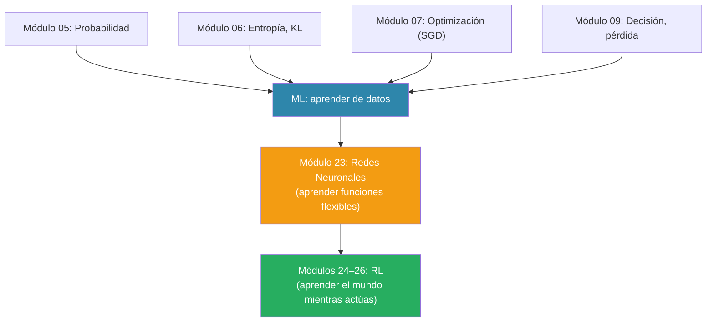

# Aprendizaje Automático

> *"A computer program is said to learn from experience E with respect to some class of tasks T and performance measure P, if its performance at tasks in T, as measured by P, improves with experience E."* — Tom Mitchell

---

En los módulos anteriores tratamos el mundo como **conocido**: en decisión (Módulo 9) asumimos distribuciones dadas, en programación dinámica (Módulo 21) conocíamos costos y transiciones, en HMMs (Módulo 20) conocíamos parámetros. Pero en la realidad, **los parámetros rara vez están ahí servidos**. Están escondidos en datos, y hay que extraerlos.

El aprendizaje automático (*machine learning*, ML) es el toolkit que responde exactamente esa pregunta: cómo aprender patrones a partir de datos. En este curso lo ocupamos por dos razones:

1. **Como herramienta general** — muchos problemas prácticos de IA son "tengo datos, quiero predecir". Regresión, clasificación, estimación de densidades.
2. **Como preparación para RL** — en unas clases, cuando volvamos al agente, ya no vamos a *conocer* las transiciones ni las recompensas. El agente va a tener que aprenderlas mientras actúa. Para hacer eso bien, necesitamos primero entender qué significa aprender de datos en general.

Esta clase no intenta cubrir ML desde cero en 90 minutos — no se puede. En lugar de eso, la estructura es:

- **Tú lees** el Capítulo 5 ("Machine Learning Basics") de Goodfellow, Bengio & Courville (*Deep Learning*, 2016). Es la lectura canónica del área al nivel de abstracción que el resto del curso asume.
- **En clase** discutimos, contextualizamos, y conectamos lo que leíste con lo que ya sabes (probabilidad, información, optimización) y con lo que sigue (redes neuronales, RL).

La lectura y las instrucciones específicas están en la siguiente página: **[Lecturas →](a_lecturas.md)**.

---

## ¿Qué vas a poder hacer al terminar la clase?

1. **Explicar** qué es ML en términos de tareas, medidas de desempeño y experiencia.
2. **Distinguir** entrenamiento, validación y prueba — y por qué necesitas los tres.
3. **Articular** el dilema capacidad–sesgo–varianza (*underfitting* vs. *overfitting*) y cómo la regularización lo modula.
4. **Reconocer** cuándo estás haciendo estimación por máxima verosimilitud (MLE) y cuándo estimación bayesiana — y qué distingue a las dos.
5. **Explicar** por qué la mayoría de los algoritmos modernos usan *stochastic gradient descent* como solver subyacente (conexión directa con el Módulo 7 — Optimización).
6. **Identificar** la "maldición de la dimensionalidad" y la **hipótesis del manifold** como las dos ideas que motivan el aprendizaje profundo (la próxima clase).

---

## Prerrequisitos — herramientas que vas a *reusar* en la lectura

| Concepto | Módulo | Cómo aparece en la lectura |
|----------|--------|----------------------------|
| Distribuciones, esperanza, varianza | [05 — Probabilidad](../05_probabilidad/00_index.md) | Fundamento de todo ML: los datos son muestras de una distribución; los estimadores son variables aleatorias |
| Entropía, KL-divergence, entropía cruzada | [06 — Teoría de la Información](../06_teoria_de_la_informacion/00_index.md) | La pérdida *cross-entropy* es literalmente la KL entre la distribución empírica y la predicha |
| Descenso de gradiente, optimización | [07 — Optimización](../07_optimization/00_index.md) | Entrenar un modelo = resolver un problema de optimización; SGD es el caballo de batalla |
| Teoría de la decisión, máxima utilidad esperada | [09 — Teoría de la Decisión](../09_teoria_decision/00_index.md) | Elegir una hipótesis óptima es decidir bajo una función de pérdida |

No vas a tener que releer estos módulos — la lectura los asume y los reusa. Si algo te confunde, el módulo correspondiente es el lugar para regresar.

---

## Mapa conceptual

---

## Cómo estudiar esta clase

1. **Antes de clase**: lee los rangos de páginas indicados en [Lecturas](a_lecturas.md). No necesitas entender cada detalle matemático — identifica las ideas principales.
2. **Toma notas** de dos tipos:
   - Conceptos que *ya conocías* de los prerrequisitos y reapareceron aquí con otro nombre.
   - Conceptos *nuevos* que no entiendes bien — son candidatos para discutir en clase.
3. **En clase**: vamos a discutir, aclarar dudas, y conectar la lectura con lo que sigue.

---

**Siguiente:** [Lecturas →](a_lecturas.md)
