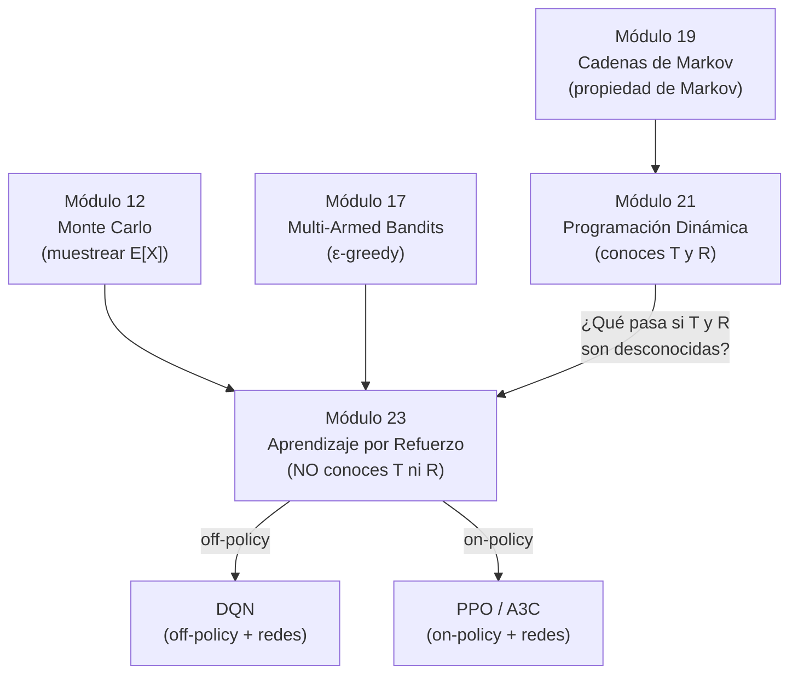

> *"La experiencia es el mejor maestro... pero solo si aprendemos de ella."*
> — anónimo

## ¿Por qué este módulo?

En el módulo 21 resolviste la escalera con programación dinámica: dado el MDP $(S, A, T, R, \gamma)$, calculaste $Q^∗$ y encontraste la política óptima $0 \to 2 \to 4 \to 5$.
Pero al final quedó una pregunta abierta:

> **¿Qué haces cuando no conoces $T$ ni $R$?**

Eso es exactamente el problema de aprendizaje por refuerzo (RL).
El agente solo puede *interactuar* con el ambiente — ejecutar acciones, observar estados y recibir recompensas — sin acceso a las tablas de transición.
La escalera regresa en este módulo, ahora con costos escondidos: mismas reglas, mismo objetivo, pero el agente tiene que *descubrir* $Q^∗$ jugando.

---

## Objetivos de aprendizaje

Al terminar este módulo podrás:

1. Formalizar el problema RL como un MDP con $T$ y $R$ ocultos, y distinguirlo de la planificación clásica.
2. Definir trayectoria, episodio y retorno $G_t$ con descuento $\gamma$.
3. Explicar por qué $Q^∗$ es más útil que $V^∗$ cuando no conoces $T$.
4. Derivar la ecuación de Bellman para $Q^\pi$ y para $Q^∗$, y señalar la única diferencia entre ellas.
5. Distinguir política de comportamiento (μ) y política objetivo (π), y clasificar un algoritmo como *on-policy* u *off-policy*.
6. Implementar SARSA y Q-learning sobre un ambiente tabular y rastrear la evolución de la tabla $Q$ episodio a episodio.
7. Predecir a qué converge cada algoritmo con $\varepsilon$ fijo y con $\varepsilon \to 0$.
8. Identificar el límite de escalabilidad de la tabla $Q$ y el paso hacia la aproximación de funciones.
9. Explicar los dos problemas que DQN resuelve (muestras correlacionadas, blanco móvil) y cómo los resuelve (experience replay, red objetivo).
10. Describir la función de pérdida MSE de DQN, señalando la diferencia entre $\theta$ y $\theta^-$.
11. Contrastar el gradiente de política (REINFORCE, PPO) con los métodos basados en valor, e identificar cuándo cada familia es preferible.
12. Ejecutar el demo interactivo de CartPole y leer las curvas de convergencia para los cuatro métodos (Q-tabla, SARSA, Q-learning, DQN).

---

## Contenido del módulo

| # | Página | Idea clave |
|---|--------|------------|
| 01 | [El problema y la notación](./01_el_problema_y_la_notacion.md) | MDP sin $T$/$R$; retorno $G_t$; definición de $Q^∗$ y por qué es mejor que $V^∗$ |
| 02 | [On-policy vs Off-policy](./02_on_policy_vs_off_policy.md) | La tabla $Q$ como objeto concreto; el error TD $\delta_t$; las dos ecuaciones de Bellman; la bifurcación SARSA / Q-learning |
| 03 | [SARSA](./03_sarsa.md) | El quintuple $(S,A,R,S',A')$; traza sobre la escalera; convergencia a $Q^{\pi_\varepsilon}$ |
| 04 | [Q-learning](./04_q_learning.md) | Un símbolo de diferencia; convergencia a $Q^∗$; el círculo completo con módulo 21 |
| 05 | [Cierre tabular](./05_cierre.md) | Tabla comparativa SARSA / Q-learning; límites de la tabla $Q$ |
| 06 | [De la tabla a las redes](./06_de_la_tabla_a_las_redes.md) | CartPole; la sustitución $Q[s,a] \to Q_\theta(s,a)$; experience replay; red objetivo; función de pérdida DQN |
| 07 | [Gradiente de política](./07_gradiente_de_politica.md) | REINFORCE; Actor-Critic; PPO con clipping; RLHF y ChatGPT |
| 08 | [Laboratorio aplicado](./08_laboratorio_aplicado.md) | Demo en vivo de 4 métodos en CartPole; setup del entorno; comparación de convergencia |

---

## Materiales y flujo de trabajo

| Recurso | Descripción | Enlace |
|---------|-------------|--------|
| Lectura guiada | Páginas 01–05 de este módulo | Este sitio |
| Notebook interactivo | SARSA y Q-learning sobre la escalera + extensión a gridworld |  |
| Script de imágenes | `lab_rl.py` genera las figuras del módulo | `clase/23_reinforcement_learning/lab_rl.py` |

**Flujo sugerido:** Lee páginas 01–02 → abre el notebook y ejecuta las celdas de configuración → lee páginas 03–04 comparando con el notebook → cierra con la página 05.

---

## Prerrequisitos

| Módulo | Concepto necesario |
|--------|--------------------|
| [Módulo 12 — Monte Carlo](../12_montecarlo/00_index.md) | Estimación de esperanzas por muestreo; media empírica como aproximación de $\mathbb{E}[X]$ |
| [Módulo 17 — Multi-Armed Bandits](../17_multi_armed_bandits/00_index.md) | $\varepsilon$-greedy; dilema exploración-explotación; actualización incremental de la media |
| [Módulo 19 — Cadenas de Markov](../19_cadenas_de_markov/00_index.md) | Propiedad de Markov; distribución estacionaria |
| [Módulo 21 — Programación Dinámica](../21_programacion_dinamica/00_index.md) | MDP $(S,A,T,R,\gamma)$; iteración de valor; $Q^∗$ de la escalera |

---

## El arco del curso

La diferencia fundamental entre DP y RL es una sola línea:

| | Programación Dinámica | Aprendizaje por Refuerzo |
|--|----------------------|--------------------------|
| $T(s' \mid s,a)$ | **conocida** | **desconocida** |
| $R(s,a,s')$ | **conocida** | **desconocida** |
| Herramienta | Ecuaciones de Bellman (exactas) | Actualizaciones TD (aproximadas) |
