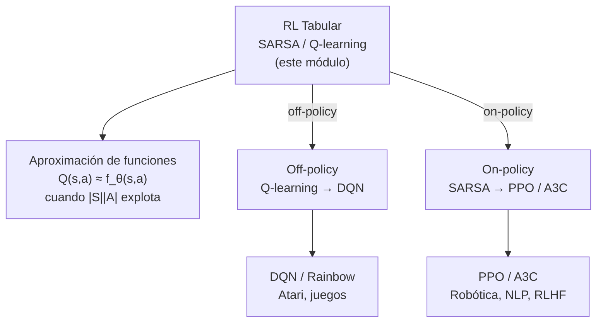

## SARSA vs Q-learning: la tabla definitiva

| Dimensión | SARSA | Q-learning |
|-----------|-------|------------|
| **Regla de actualización** | $Q(s,a) \leftarrow Q(s,a) + \alpha[r + \gamma Q(s',a') - Q(s,a)]$ | $Q(s,a) \leftarrow Q(s,a) + \alpha[r + \gamma \max_{a'} Q(s',a') - Q(s,a)]$ |
| **Target** | $r + \gamma Q(s', a')$ — con $a' \sim \pi_\varepsilon$ | $r + \gamma \max_{a'} Q(s', a')$ — máximo sobre $s'$ |
| **Política de comportamiento** $\mu$ | $\varepsilon$-greedy | $\varepsilon$-greedy |
| **Política objetivo** $\pi$ | $\varepsilon$-greedy ($\mu = \pi$) | greedy pura ($\mu \neq \pi$) |
| **Clasificación** | On-policy | Off-policy |
| **Convergencia (ε fijo)** | $Q^{\pi_\varepsilon}$ | $Q^{∗}$ |
| **Convergencia (ε → 0)** | $Q^{∗}$ | $Q^{∗}$ |
| **Ventaja práctica** | Más seguro en entornos con estados peligrosos | Aprende $Q^{∗}$ más rápido; útil cuando la exploración puede ser costosa |

---

## ¿Cuándo importa la diferencia?

En la escalera, la diferencia entre SARSA y Q-learning es sutil: ambos convergen al mismo resultado con $\varepsilon \to 0$.
Pero en entornos con estados *irreversiblemente malos*, la distinción es crucial.

**Intuición del acantilado** (cliff walking, Sutton & Barto):
Imagina un corredor al borde de un precipicio.
El camino más corto al objetivo pasa cerca del borde.
Un agente que explora con $\varepsilon$-greedy puede caer ocasionalmente.

- **Q-learning** aprende que el camino óptimo (el más corto) tiene valor alto — porque su target ignora las caídas durante la exploración.
  Con $\varepsilon$ fijo, Q-learning "recomienda" el camino peligroso aunque el agente siga cayendo.

- **SARSA** aprende el valor *real* del camino que ejecuta, incluidas las caídas.
  Con $\varepsilon$ fijo, prefiere el camino seguro aunque sea más largo.

La moraleja: **SARSA es más seguro cuando la exploración tiene consecuencias reales**.
Q-learning es más eficiente cuando el coste de explorar es bajo o cuando solo nos importa la política final.

---

## El límite de la tabla $Q$

La tabla $Q$ tiene $|S| \times |A|$ celdas.
Para la escalera ($|S|=5$, $|A|=2$), eso es 10 celdas — trivial.

Pero considera:

| Problema | $|S|$ | $|A|$ | Celdas $Q$ |
|----------|-------|-------|------------|
| Escalera | 5 | 2 | 10 |
| Ajedrez | $\approx 10^{47}$ | $\approx 35$ | $\approx 3 \times 10^{48}$ |
| Atari (píxeles) | $256^{33600}$ | 18 | imposible |
| Robot (sensores continuos) | $\infty$ | continuo | imposible |

La tabla explota.
En espacios de estados grandes o continuos, **no es posible mantener una celda por par $(s,a)$**.

---

## Hacia la aproximación de funciones

La solución: en lugar de una tabla, usa una **función paramétrica**:

$$Q(s,a) \approx f_\theta(s,a)$$

donde $\theta$ son los parámetros (por ejemplo, los pesos de una red neuronal).

La regla de actualización TD sigue siendo la misma — solo que en vez de actualizar una celda, hacemos un paso de gradiente sobre $\theta$:

$$\theta \leftarrow \theta + \alpha\delta_t\nabla_\theta f_\theta(s,a)$$

Esto da lugar a dos familias de algoritmos modernos:

**Off-policy + función aprox.** → **DQN (Deep Q-Network)**
- Usa una red neuronal para $f_\theta(s,a)$.
- Mismo principio que Q-learning: el target usa $\max_{a'}$.
- Novedades: experience replay (rompe correlaciones entre muestras) y red objetivo congelada (estabiliza el target).
- Logró rendimiento humano en 49 juegos de Atari (DeepMind, 2015).

**On-policy + gradiente de política** → **PPO, A3C (Policy Gradient)**
- En vez de aprender $Q$, aprende directamente una política $\pi_\theta(a \mid s)$.
- El gradiente de política (Policy Gradient Theorem) dirige $\theta$ hacia acciones con retorno alto.
- PPO (Proximal Policy Optimization) añade un clipping que estabiliza el entrenamiento.
- Base de ChatGPT (RLHF usa PPO), robótica, Alpha Go.

---

## El paisaje del RL

---

## Lo que aprendimos en este módulo

Empezamos con la pregunta que quedó sin respuesta en el módulo 21:

> *¿Cómo encontrar $Q^{∗}$ cuando no conoces $T$ ni $R$?*

La respuesta es: interactúa con el ambiente, observa $(s, a, r, s')$, y usa la actualización TD para empujar $Q$ hacia la consistencia de Bellman.

La diferencia entre SARSA y Q-learning se reduce a un símbolo: $Q(s',a')$ vs $\max_{a'} Q(s',a')$.
Ese símbolo determina si el algoritmo aprende el valor de lo que hace (on-policy, SARSA) o el valor de lo que podría hacer óptimamente (off-policy, Q-learning).

Ambos convergen a $Q^{∗}$ con suficiente experiencia y $\varepsilon \to 0$.
Y cuando la tabla ya no cabe — que es casi siempre en problemas reales — la misma idea de bootstrapping TD sobrevive intacta dentro de redes neuronales profundas.
